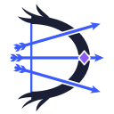

# daedalus

<!-- markdownlint-disable MD033 -->
<p align="center"></p>
<p align="center"><em>“When used, it causes a wide spread of arrows to rain from the sky.”</em> — <a href="https://terraria.wiki.gg/wiki/Daedalus_Stormbow">Daedalus Stormbow</a></p>
<!-- markdownlint-enable MD033 -->

daedalus puts your personal API keys behind 1 endpoint and uses a classifier to select a model for each task.

daedalus is in development. The code changes fast, and it breaks faster.

## Features

- 1 OpenAI-compatible endpoint for 8 providers: Cloudflare, Gemini, Groq, Kilo, Mistral, OpenRouter, Pollinations and Z.ai. Each provider gets its native API, Gemini included.
- 4 pools (tiers) and `daedalus/auto`, which selects a tier from the prompt with the [LiteLLM](https://github.com/BerriAI/litellm) [AutoRouter heuristic v2](https://docs.litellm.ai/blog/heuristic-v2) classifier.
- A [fallback ladder](docs/architecture.md#pools-and-the-fallback-ladder): when a model fails, the next model gets the request. The chain walks up the tiers first, then down.
- [Weights](docs/architecture.md#weights) that change after each request. A weight goes up on an answer and down on a fault, a slow answer or a rate limit. It also goes up with time.
- [Session affinity](docs/architecture.md#session-affinity) in 3 modes (`none`, `session`, `race`), so a conversation keeps its model.
- A conversation tier that does not go down, and keywords, such as "think hard", that move it 1 tier up.
- [Loop fallback](docs/architecture.md#loops): a model that repeats a tool call 3 times or a thinking passage 4 times gets a fault. The next model continues.
- A [try again](docs/architecture.md#try-again) in Open WebUI moves the message 1 tier up. The rule needs the shipped [owui_auto_reasoning_effort](docs/hooks/owui_auto_reasoning_effort.md) hook.
- Before a request, daedalus skips the models without tools, without vision or with a too-small context window. Each provider or model can carry an [order](docs/architecture.md#order).
- A model catalog from provider discovery and LiteLLM data, rebuilt on a schedule, in place of a hand-written model list.
- Endpoints for embeddings, transcriptions, speech and images, and a dashboard for pools, requests, models, API keys, providers and settings.
- Docker Compose, with optional Open WebUI, Tika, SearXNG, Headroom and Tailscale.

daedalus is for personal use only. Do not share it with other users, because the provider terms of service can forbid it.

## Hooks

A hook is 1 Python file in the [`hooks`](hooks) folder that changes a catalog row, a chat request or an answer. A config key or a model block names the file, and daedalus calls it at the point of the change. The base runs with no hook file, and the shipped files are examples. The folder comes from `hooks.dir`, and a file carries a `# ---` frontmatter block with its version, its surfaces and its scope.

[`hooks/example.py`](hooks/example.py) is the start for a new hook file. It holds 1 stub for each surface, with an example in the comments:

```python
def on_upstream(body, model, headers):
  if "order" in body.get("provider", {}):
    body["provider"]["allow_fallbacks"] = False
```

Copy the file under a new name, keep the functions you need, and name the copy in the `hooks` list of the model or the provider. The surfaces, the frontmatter, the GitHub sources and the errors are in [Hooks](docs/hooks.md). Each shipped file has its own page under [`docs/hooks`](docs/hooks).

## Quick start

1. Run the install command. First, it shows what it installs or downloads and asks `[y/N]`. Then it installs Docker if Docker is missing. It downloads the daedalus files to the `daedalus` folder in your home folder and makes `.env` with a new master key. Then it starts daedalus and shows the master key.

   cmd or PowerShell:

   ```cmd
   powershell -NoProfile -ExecutionPolicy Bypass -c "irm https://raw.githubusercontent.com/nemoe7/daedalus/main/install.ps1 | iex"
   ```

   bash (Linux or Raspberry Pi):

   ```bash
   curl -fsSL https://raw.githubusercontent.com/nemoe7/daedalus/main/install.sh | bash
   ```

   On Windows, winget installs Docker Desktop. Restart Windows, start Docker Desktop once, then run the command again. On Linux, the official script `get.docker.com` installs Docker.

   In a git checkout, the install scripts use the checkout folder. Add `--dev`, for example
   `install.cmd --dev`, to run the dev image with [`compose.dev.yml`](compose.dev.yml). With the source in the folder,
   the script builds the image. Without the source, it pulls `ghcr.io/nemoe7/daedalus:dev`.

2. Open the dashboard at `http://localhost:3357/`. The user is `DAEDALUS_USERNAME`, else `admin`. The password is `DAEDALUS_PASSWORD`, else `DAEDALUS_MASTER_KEY`.
3. On **Providers**, paste each provider key into its **API key** field and save. For Cloudflare, add the Account ID too. Click the Catalog chip to rebuild the model list. The dashboard saves pasted values in state. The shipped [`config/providers/free.yml`](config/providers/free.yml) keeps `env:NAME` references for `.env` values. See [Configuration](docs/configuration.md).
4. On the **API keys** page, make a key for each client.

| Client setting | Value |
| --- | --- |
| Base URL | `http://localhost:3357/v1` |
| API key | A key from the **API keys** page |
| Model | `daedalus/auto`, a pool name, or a `provider/slug` from the **Models** page |

The tested clients are Kilo Code and Open WebUI.

## Run without Docker

Install [uv](https://docs.astral.sh/uv/getting-started/installation/).

cmd or PowerShell:

```cmd
powershell -ExecutionPolicy ByPass -c "irm https://astral.sh/uv/install.ps1 | iex"
```

bash:

```bash
curl -LsSf https://astral.sh/uv/install.sh | sh
```

Install daedalus with the versions in [`uv.lock`](uv.lock), then start the router. The commands are the same in all 3 shells:

```sh
uv sync
uv run daedalus serve
```

Put `uv run` before each command in the table. After `git pull`, run `uv sync` again. After a dependency change in [`pyproject.toml`](pyproject.toml), run `uv lock`.

| Command | What it does |
| --- | --- |
| `daedalus serve [PORT] [--catalog]` | Starts the router on `0.0.0.0:PORT` (default 3357). `--catalog` rebuilds the model store first. |
| `daedalus catalog [--force]` | Discovers the provider models and rebuilds the model store. A live server does the work, and a refused request stops the command. `--force` rebuilds the store here after a refusal. |
| `daedalus dump [all\|catalog\|models]` | Writes the provider catalogs, or every stored model row with the tier that claims it, to `.daedalus-state/dump`. |
| `daedalus hooks update` / `hooks list` / `hooks verify` | Reads the `hooks.sources` repos and writes the files, lists the installed files, or compares them against `hooks.lock.json`. |

`daedalus catalog` looks for a live server first. It probes `DAEDALUS_URL`, or
`http://DAEDALUS_HOST:DAEDALUS_PORT`, on `/health` with a 0.3 s limit. On an answer the command
prints 1 line and asks that server to rebuild. The route is `POST /v1/catalog`, behind the master
key. With no answer the command rebuilds in its own process, as before.

## Development

`uv sync` also installs the development tools: pytest, pytest-xdist and Ruff. CI runs these commands for each code change:

```sh
uv run pytest
uv run ruff check
uv run ruff format --check
```

- `uv run pytest` runs the test files in parallel, with 1 worker for each CPU. `uv run pytest -n 0` runs them in 1 process.
- Each test file gets a temporary state folder. The tests do not change `.daedalus-state`.

## Documentation

| Page | Contents |
| --- | --- |
| [Docs index](docs/README.md) | Every page, in the order of a first read |
| [Architecture](docs/architecture.md) | Request flow, classification, fallback ladder, weights, session affinity and loops |
| [API](docs/api.md) | Endpoints, model names, access and errors |
| [Configuration](docs/configuration.md) | Environment variables, [`config/daedalus.yml`](config/daedalus.yml) and provider files |
| [Providers](docs/providers.md) | Supported providers and what each one can do |
| [Provider keys](docs/provider-keys.md) | The steps that make a key for each provider |
| [Deployment](docs/deployment.md) | Docker Compose, profiles, Open WebUI, Tika, SearXNG, Headroom and Tailscale |
| [Open WebUI integration](docs/integrations/owui.md) | The skills, the filters and the tools of the [`integrations/openwebui`](integrations/openwebui) folder |
| [Dashboard](docs/dashboard.md) | Pages and API keys |
| [Hooks](docs/hooks.md) | Python files that change catalog rows, requests and answers. Each shipped file has its own page |
| [Decisions](docs/adr/) | Architecture decision records |

## License

daedalus uses the [daedalus Noncommercial License 1.0.0](LICENSE.md). You can use, change and share it for personal and other noncommercial purposes. Shared changes use the same terms and come with their source code. Commercial use needs a separate license from the licensor.

The classifier and its data come from [LiteLLM](https://github.com/BerriAI/litellm) (MIT). Its license is in [`daedalus/routing/artifacts/LITELLM-LICENSE.txt`](daedalus/routing/artifacts/LITELLM-LICENSE.txt).
