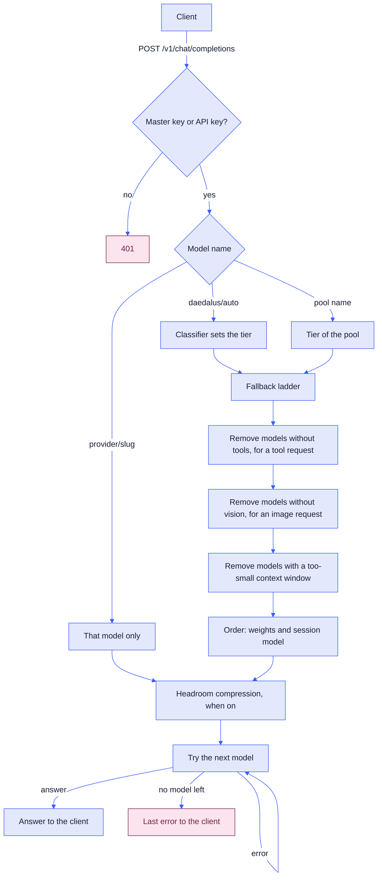
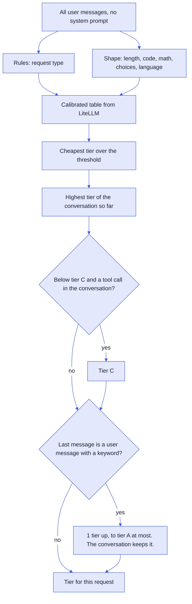
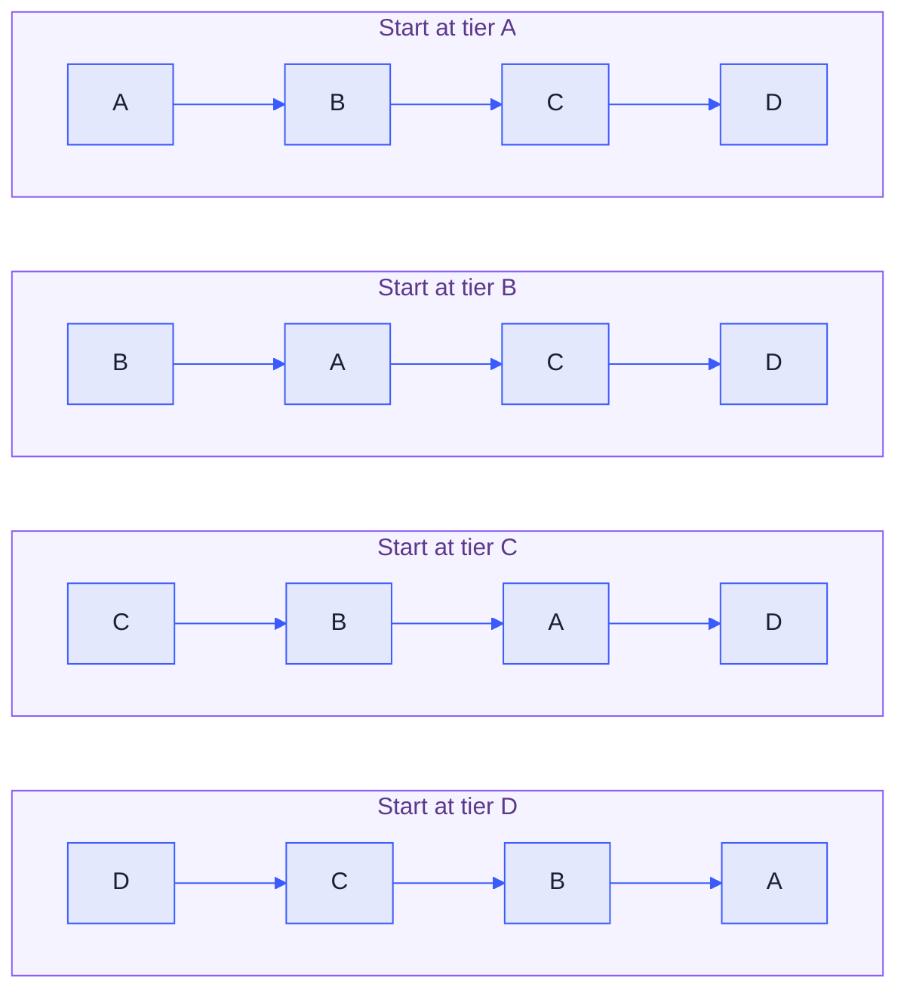
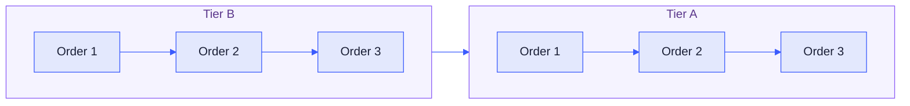
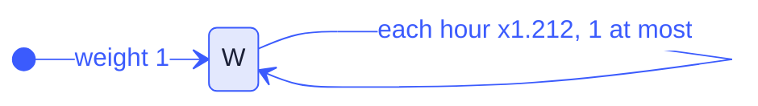
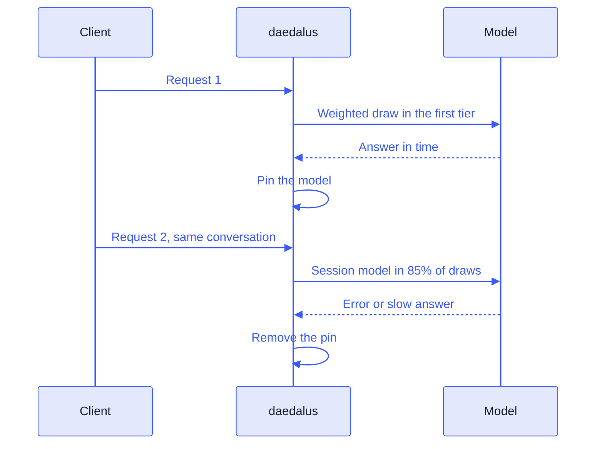

# Architecture

daedalus provides an OpenAI endpoint. It routes requests to a free model of the correct size and capability. If the model fails, it moves on to the next suitable option.

## Request flow



| Step | Rule |
| --- | --- |
| Access | `/v1` needs the master key or an API key from the dashboard. |
| Tool filter | A request with `tools` skips the models that cannot call tools. |
| Vision filter | A request with an `image_url` part skips the models without `supports_vision` true. See [API](api.md#chat-completions). |
| Context filter | Tokens = characters / 4, input only. A smaller-context model leaves the list. |
| No model fits | The client gets 400 `context_length_exceeded`. |
| Error | The next model gets the request. The client sees only the last error. |
| Stream | When a stream stops, the next model continues the answer. |
| Client cancel | A client close before the last byte stops the request. No fault, no next model. |

The end client only sees the last error to provide a cleaner transition between models in the fallback ladder.

### Client headers

Each provider request carries the headers of the client request, for example `HTTP-Referer` and `X-Title`. OpenRouter uses these 2 headers to show the app, for example Kilo Code. The provider headers, for example the provider key, replace a client header with the same name.

| Kept back | Headers |
| --- | --- |
| Credentials | `Authorization`, `Cookie`, `X-Api-Key`, `Api-Key`, `X-Goog-Api-Key` |
| Transport | `Host`, `Accept`, `Accept-Encoding`, `Content-Type`, `Content-Length`, `Content-Encoding`, `Transfer-Encoding`, `Connection`, `Keep-Alive`, `TE`, `Trailer`, `Upgrade`, `Expect` |
| Proxy | `Forwarded`, `Via`, `X-Real-IP`, `Proxy-*`, `X-Forwarded-*`, `Tailscale-*` |
| Open WebUI user | `X-OpenWebUI-User-*`: the name, e-mail, id and role of the user |

## Classification

Only `daedalus/auto` uses the classifier. A pool name or a `provider/slug` name skips it.



| Input | Effect |
| --- | --- |
| Request type | 1 of 7 types, from the first rule that matches. No match: `general`. |
| Length | More than 2000 characters moves the text to a higher tier. |
| Conversation | The tier does not go down until the session expires (1 h idle). |
| Tool call | After the first tool call, the tier is C or higher, and the search stops. |
| Keyword | An `escalation.keywords` match in the last user message moves the tier 1 step up. |

The classifier is a copy of the [LiteLLM](https://github.com/BerriAI/litellm) [AutoRouter heuristic v2](https://docs.litellm.ai/blog/heuristic-v2). It is not perfect, but it is a good start.

## Pools and the fallback ladder

| Pool | Tier | Models |
| --- | --- | --- |
| `daedalus/sophos` | A | Big strong thinking models |
| `daedalus/deinos` | B | Weaker thinking models |
| `daedalus/koinos` | C | Stronger models that do not think |
| `daedalus/moros` | D | Small models |

When a tier has no model that answers, the chain goes up to tier A, then down from the start:



The chain goes up first. The next tier up can usually do the same request. The chain goes down only after it gets to the highest tier. A lower tier often fails, because its models can do less.

### Order

Inside each tier, the models of order 1 go first, then the models of order 2, and so on. The weights and the session model choose a model inside 1 order. A session model of order 2 goes first only when its tier has no model of order 1 left. The media pools use the order too. The chain skips an order with no model.



| Provider | Order | Why |
| --- | --- | --- |
| Cloudflare | 2 | The daily Neurons go to images and transcription first |
| Pollinations | 2 | No order-1 image model: Cloudflare and Pollinations share the image pool by weight |
| Other providers | 1 | The default |

## Weights

Each model has 1 weight for all pools. The first tier uses a weighted draw. The next tiers use the weight order.



| Event | Factor |
| --- | --- |
| Success | x1.5, 1 at most |
| Fault (the next model got the request) | x0.5 |
| [Loop](#loops) (tool, thinking or answer) | x0.5, as a fault |
| Slow success (first token after 30 s) | x0.75 |
| Rate limit (HTTP 429) | x0.75, and a cooldown |
| Recovery | x1.212 for each hour |
| Lowest weight | 0.01 |

## Cooldowns

A model in a cooldown leaves each chain and each media pool. A session model in a cooldown loses its pin. The first rule that applies sets the cooldown end:

| Rule | Cause | Cooldown end | Reason in the log |
| --- | --- | --- | --- |
| 1 | Gemini 429 with a `quotaId` that has `PerDay` | Next 00:00 Pacific time | `daily` |
| 1 | Cloudflare error 4006. The cooldown covers all Cloudflare models. | Next 00:00 UTC | `daily` |
| 2 | `retry-after` or `x-ratelimit-reset` header, or Gemini `RetryInfo.retryDelay` | That time | `reset` |
| 3 | No reset time | 60 s, then double each backoff, 6 h at most. A success: 60 s again. | `backoff` |

Some limits start a cooldown with no 429. A longer cooldown stays.

| Cause | Cooldown end | Reason in the log |
| --- | --- | --- |
| An answer with 0 left of a day or month in its `x-ratelimit-*`, still delivered. | The reset header time, else the next 00:00 UTC or the next month start | `limit` |
| The hourly OpenRouter check: 0 free requests left. The cooldown covers all `:free` models. | Next 00:00 UTC | `limit` |

| Item | Value |
| --- | --- |
| Log line | `cooldown groq/llama-4-scout 120.000s reason=backoff` |
| `provider/slug` request to a model in a cooldown | HTTP 429 `rate_limit_exceeded`, with no upstream request |
| Each model of a chain in a cooldown | HTTP 429 `rate_limit_exceeded`. `Retry-After` is the seconds to the first cooldown end. |
| Storage | `.daedalus-state/models.sqlite3`, kept after a restart |
| Dashboard | Models: the cooldowns and lanes with the time left. Requests: the starting requests. |

## Client lanes

A client with its own key in [`client_keys`](configuration.md#client-keys) has its own lane on each model of that provider. The cooldowns and the pacing counts use the lane key `provider/slug#client`. The Cloudflare daily cooldown of that client uses `cloudflare/*#client`. A 429 on the key of 1 client does not stop the other clients.

## Pacing

A model with `rpm` or `tpm` in its provider file leaves the chains and the media pools at that limit. A provider with `hourly_requests` leaves them at that limit, with all its models.

| Item | Value |
| --- | --- |
| Window | The last 60 s |
| Requests | Each request that daedalus sent to the model, fallbacks included |
| Tokens | The input estimate of the context check: characters / 4. Media requests count 0 tokens. |
| Skip | Silent. The weight does not change, and the log has no line. |
| Provider hour | The last-hour requests to all provider models, per client. A 429 uses the hour rest. |
| Each model skipped | HTTP 429 `rate_limit_exceeded`. `Retry-After`: the time until the first model takes requests again. |
| Client with its own key | Its own counts, against the same `rpm` and `tpm`. See [Client lanes](#client-lanes). |
| Storage | Memory only. A restart sets the counts to 0. |

## Session affinity

A conversation keeps its model (the session model) in each slot.



| Item | Value |
| --- | --- |
| Conversation key | SHA-256 of the bearer token and the first user message |
| Slot | The pool name, or `daedalus/auto` plus the tier |
| Share of first-tier draws | 85% |
| Pin removed by | A fault, a slow success or a `switch.keywords` match |
| Expiry | 1 h with no request |
| Storage | `.daedalus-state/models.sqlite3`, kept after a restart |

Session affinity keeps 1 response style in a conversation. It also lets the conversation use the prompt cache of the provider. The cache is not guaranteed, but it helps when the provider has one. Without session affinity, the styles of different models mix in 1 conversation. Tests showed that the result is a mess.

## Try again

A try again in Open WebUI on `daedalus/auto` moves the repeated message 1 tier up.

| Item | Value |
| --- | --- |
| Found by | The same chat id and messages as an earlier answered request, system messages excluded. |
| Tier | 1 above the pool that answered the last attempt |
| At tier A | A tier A model that did not answer this message. After all, the list restarts. |
| Next new message | The classifier and the session tier, as before |
| Session model | The model that answers becomes the session model of its tier slot |
| Weights | No change for the earlier answer |
| Log | `retry=N`. The Requests page shows `rtN`. |
| Expiry | 1 h with no repeat of the message, in memory only |
| Other clients, chat pools, `provider/slug` | No change |

## Loops

A loop is a fault of the model that made it. See [ADR 4](adr/0004-penalties.md#loops).

| Loop | Found by | Next step |
| --- | --- | --- |
| Tool | 3 same-tool-and-arguments calls since the last user message, the last in the last assistant message | The model that made the call is the last fallback |
| Thinking | A passage of 20 to 2,000 characters, 4 times in a row | Stream: the next model continues. No stream: the next model gets the request. |
| Answer | The same, in the answer text | As thinking. The next model continues after the first copy of the passage. |
| Log | Tool: `loop=N` on the Requests page. Thinking and answer: the result `loop`. | |

## Media pools

| Pool | Endpoint | Models |
| --- | --- | --- |
| Transcription pool | `POST /v1/audio/transcriptions` | All catalog models with the mode `audio_transcription` |
| Image pool | `POST /v1/images/generations` | All catalog models with the mode `image_generation` |
| Image pool | `POST /v1/images/edits` | The models with the mode `image_generation` and `supports_vision` |

| Item | Value |
| --- | --- |
| Order | A weighted draw, then the weight order |
| Weights | The same weights as the chat models |
| Skip | A model that cannot do the request leaves it, with no fault. |
| Try again | The same key and content as an earlier answered pool request. Transcription: audio and fields. |
| Models of a try again | The models that answered this content leave. After all, the list restarts. |
| Log | `retry=N` |
| Expiry | 1 h with no repeat of the message, in memory only |
| Embeddings and speech | No pool. `provider/slug` only. |

By default, Open WebUI writes a new image prompt for each try. So a try again in Open WebUI chat is a new weighted draw, not a repeat.

Transcription and images get a pool, because the answer of another model is still usable: the same text, or an image of the same prompt. Embeddings and speech have no pool. Vectors from 2 embedding models have different sizes and meanings, so a fallback breaks a stored index. 2 speech models have different voices.

## State database

`.daedalus-state/models.sqlite3` holds the model store and the state of the other modules.

| Item | Value |
| --- | --- |
| Layout | `daedalus/store/schema.py`, as SQLAlchemy Core tables |
| Steps | Alembic, 1 file for each change in `daedalus/store/migrations/versions/`. `alembic_version` holds the step. |
| Upgrade | `daedalus serve` and `daedalus catalog` run the new steps before they start. |
| Requests | The request code uses `sqlite3`. SQLAlchemy and Alembic load only for the upgrade. |

A table change:

1. Change the table in `daedalus/store/schema.py` and the `CREATE TABLE` statement of its module.
2. Make the step. The command is the same in cmd, PowerShell and bash:

   ```text
   uv run alembic -c daedalus/store/alembic.ini upgrade head
   uv run alembic -c daedalus/store/alembic.ini revision --autogenerate -m "add a column"
   ```

3. Read the new step, then run the tests. `tests/store/test_migrations.py` fails until the table, the statement and the steps agree.

## Performance

daedalus is small enough for a Raspberry Pi that also runs other containers.

| Item | Value |
| --- | --- |
| Tier rows of the pools | The tier sort runs once per config and list. Reloads and changes sort again. |
| Classifier | 1 result for each prompt, for the last 64. Tool loops: the first request only. |
| State files | SQLite WAL mode. The files `models.sqlite3-wal` and `models.sqlite3-shm` are part of the store. |
| Catalog reads | Each rebuild reads each `discovery_url` and LiteLLM catalog once, Kilo and OpenRouter shared. |
| Weights, pins, cooldowns, request history | No disk wait. A power loss can lose the last writes, not the file. |
| API keys | A write waits for the disk. |
