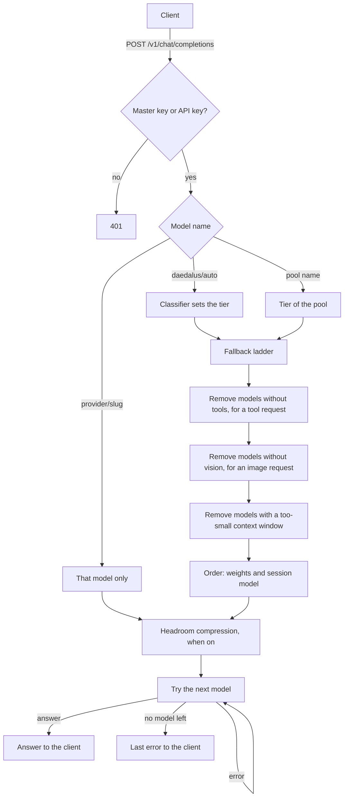
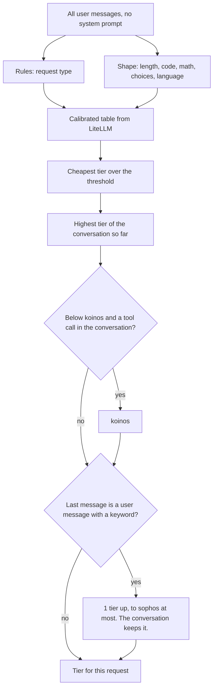
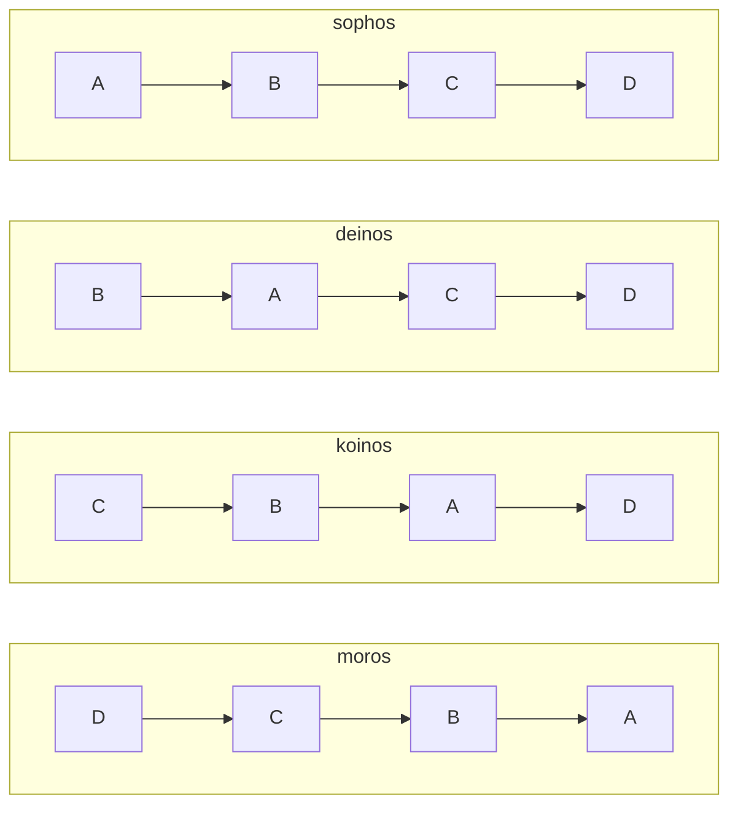
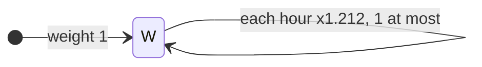
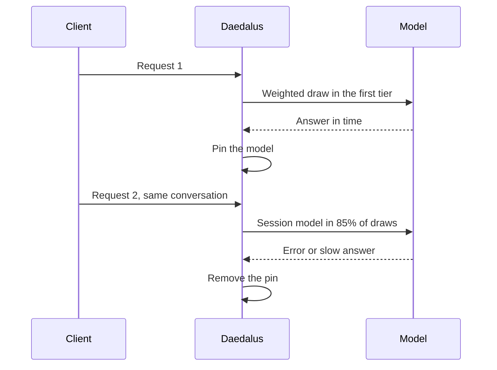

# Architecture

> Q: What is the main idea of the design, in your words?

## Request flow

| Step | Rule |
| --- | --- |
| Access | `/v1` needs the master key or an API key from the dashboard. |
| Tool filter | A request with `tools` skips the models that cannot call tools. |
| Vision filter | A request with an `image_url` part skips the models with no true `supports_vision` value. See [API](api.md#chat-completions). |
| Context filter | Tokens = characters / 4, input only. A model with a smaller context window leaves the list. No log line shows it. |
| No model fits | The client gets 400 `context_length_exceeded`. |
| Error | The next model gets the request. The client sees only the last error. |
| Stream | When a stream stops, the next model continues the answer. |
| Client cancel | When the client closes the connection before the last byte, Daedalus stops the request. No model gets a fault, and no next model gets the request. The Requests page shows "cancelled". When no answer started, the log shows status 499. |

The end client only sees the last error to provide a cleaner transition between models in the fallback ladder.

## Classification

Only `daedalus/auto` uses the classifier. A pool name or a `provider/slug` name skips it.

| Input | Effect |
| --- | --- |
| Request type | 1 of 7 types, from the first rule that matches. With no match, the type is `general`. |
| Length | More than 2000 characters moves the text to a higher tier. |
| Conversation | The tier does not go down until the session expires (1 h idle). |
| Tool call | After the first tool call, the tier is koinos or higher. A conversation at koinos or higher skips the search for tool calls. |
| Keyword | A word or phrase from `escalation.keywords` in the last message moves the tier 1 step above the conversation tier. Only a request whose last message is a user message gets this step. Thus the tool calls of the same turn do not add more steps. 2 keywords also give 1 step. |

The classifier is a copy of the LiteLLM heuristic v2. It is not perfect, but it is a good start.

## Pools and the fallback ladder

| Pool | Tier | Models |
| --- | --- | --- |
| `daedalus/sophos` | A | Big strong thinking models |
| `daedalus/deinos` | B | Weaker thinking models |
| `daedalus/koinos` | C | Stronger models that do not think |
| `daedalus/moros` | D | Small models |

When a tier has no model that answers, the chain goes up to tier A, then down from the start:

The chain goes up first. The next tier up can usually do the same request. The chain goes down only after it gets to the highest tier. A lower tier often fails, because its models can do less.

## Weights

Each model has 1 weight for all pools. The first tier uses a weighted draw. The next tiers use the weight order.

| Event | Factor |
| --- | --- |
| Success | x1.5, 1 at most |
| Fault (the next model got the request) | x0.5 |
| Slow success (first token after 30 s) | x0.75 |
| Rate limit (HTTP 429) | x0.75, and a cooldown |
| Recovery | x1.212 for each hour |
| Lowest weight | 0.01 |

## Cooldowns

A model in a cooldown leaves each chain and each media pool. A session model in a cooldown loses its pin. The first rule that applies sets the cooldown end:

| Rule | Cause | Cooldown end | Reason in the log |
| --- | --- | --- | --- |
| 1 | Gemini 429 with a `quotaId` that has `PerDay` | Next 00:00 Pacific time | `daily` |
| 1 | Cloudflare error 4006. The cooldown covers all Cloudflare models. | Next 00:00 UTC | `daily` |
| 2 | `retry-after` or `x-ratelimit-reset` header, or Gemini `RetryInfo.retryDelay` | That time | `reset` |
| 3 | No reset time | 60 s, then 2 times the last backoff, 6 h at most. A success sets it back to 60 s. | `backoff` |

| Item | Value |
| --- | --- |
| Log line | `cooldown groq/llama-4-scout 120.000s reason=backoff` |
| `provider/slug` request to a model in a cooldown | HTTP 429 `rate_limit_exceeded`, with no upstream request |
| Each model of a chain in a cooldown | HTTP 429 `rate_limit_exceeded`. `Retry-After` is the seconds to the first cooldown end. |
| Storage | `.daedalus-state/models.sqlite3`, kept after a restart |
| Dashboard | The Models page shows the time left of each cooldown. The Requests page marks each request with an attempt that started a cooldown. |

## Pacing

A model with `rpm` or `tpm` in its provider file leaves the chains and the media pools at that limit.

| Item | Value |
| --- | --- |
| Window | The last 60 s |
| Requests | Each request that Daedalus sent to the model, fallbacks included |
| Tokens | The input estimate of the context check: characters / 4. Media requests count 0 tokens. |
| Skip | Silent. The weight does not change, and the log has no line. |
| Each model skipped | HTTP 429 `rate_limit_exceeded`. `Retry-After` is the time until the oldest request leaves the window. |
| Storage | Memory only. A restart sets the counts to 0. |

## Session affinity

A conversation keeps its model (the session model) in each slot.

| Item | Value |
| --- | --- |
| Conversation key | SHA-256 of the bearer token and the first user message |
| Slot | The pool name, or `daedalus/auto` plus the tier |
| Share of first-tier draws | 85% |
| Pin removed by | A fault, a slow success or a `switch.keywords` match |
| Expiry | 1 h with no request |
| Storage | `.daedalus-state/models.sqlite3`, kept after a restart |

Session affinity keeps 1 response style in a conversation. It also lets the conversation use the prompt cache of the provider. The cache is not guaranteed, but it helps when the provider has one. Without session affinity, the styles of different models mix in 1 conversation. Tests showed that the result is a mess.

## Try again

A try again in Open WebUI on `daedalus/auto` moves the repeated message 1 tier up.

| Item | Value |
| --- | --- |
| Found by | The same `X-OpenWebUI-Chat-Id` and the same messages as the last request of that chat. System messages do not count. |
| Tier | 1 above the pool that answered the last attempt |
| At tier A | A tier A model that did not answer this message. After all tier A models, the list starts again. |
| Next new message | The classifier and the session tier, as before |
| Session model | The model that answers becomes the session model of its tier slot |
| Weights | No change for the earlier answer |
| Log | `retry=N`. The Requests page shows "try again N". |
| Expiry | 1 h with no request, in memory only |
| Other clients, chat pools, `provider/slug` | No change |

## Media pools

| Pool | Endpoint | Models |
| --- | --- | --- |
| `daedalus/graphos` | `POST /v1/audio/transcriptions` | All catalog models with the mode `audio_transcription` |
| `daedalus/photos` | `POST /v1/images/generations` | All catalog models with the mode `image_generation` |

| Item | Value |
| --- | --- |
| Order | A weighted draw, then the weight order |
| Weights | The same weights as the chat models |
| Skip | A model that cannot do the request leaves the list, for example Flux 1 with `n` above 1. A skip is not a fault. |
| Try again | The same key and the same content as the last request to that pool. For graphos, the content is the audio and the form fields. For photos, the content is the JSON body. |
| Models of a try again | The models that answered this content leave the list. After all models, the list starts again. |
| Log | `retry=N` |
| Expiry | 1 h with no request, in memory only |
| Embeddings and speech | No pool. `provider/slug` only. |

By default, Open WebUI writes a new image prompt for each try. So a try again in Open WebUI chat is a new weighted draw, not a repeat.

Transcription and images get a pool, because the answer of another model is still usable: the same text, or an image of the same prompt. Embeddings and speech have no pool. Vectors from 2 embedding models have different sizes and meanings, so a fallback breaks a stored index. 2 speech models have different voices.

## Performance

Daedalus is small enough for a Raspberry Pi that also runs other containers.

| Item | Value |
| --- | --- |
| Tier rows of the pools | Daedalus sorts the catalog models into tiers 1 time for each config and model list. A config reload or a catalog change sorts them again. |
| Classifier | 1 result for each prompt, for the last 64 prompts. The requests of 1 tool loop have the same user messages, so only the first request runs the classifier. |
| State files | SQLite WAL mode. The files `models.sqlite3-wal` and `models.sqlite3-shm` are part of the store. |
| Weights, pins, cooldowns, request history | A write does not wait for the disk. After a power loss, the last writes can go, but the file stays correct. |
| API keys | A write waits for the disk. |

