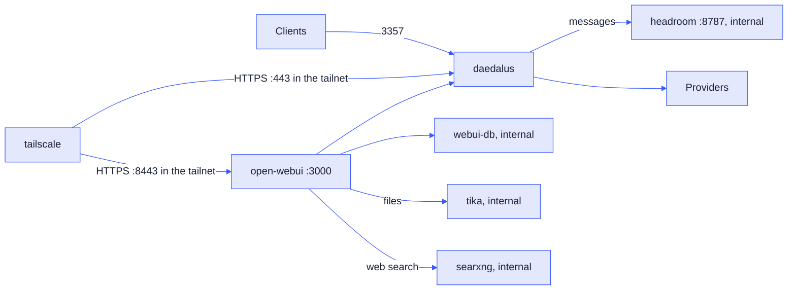

# Deployment

The reference deployment is a Raspberry Pi 4B with 8 GB of RAM. The compose file uses `slim` Docker images where they exist, to save space.

## Docker Compose

The install scripts show what they install or download and ask `[y/N]` before a change. Then they install Docker if it is missing: Docker Desktop with winget on Windows, or `get.docker.com` on Linux. Outside a git checkout, they download the files of the newest `v*` tag, else `main`, to the `daedalus` folder in the home folder. They copy only missing files, so `.env` and `config/` stay. They make `.env` with a new master key, then pull the Daedalus image and start the containers. With `--dev`, they build the image from the source with `compose.dev.yml`. See the [README](../README.md#quick-start).

The commands below are the same in cmd, PowerShell and bash.

| Task | Command |
| --- | --- |
| Start | `docker compose up -d` |
| Update | `git pull`, then `docker compose pull`, then `docker compose up -d` |
| Build from the source | `docker compose -f compose.dev.yml up -d`. `compose.dev.yml` is a copy of `compose.yml` that builds `daedalus:dev` from the source at each start. Use `-f compose.dev.yml` with the other commands too. A test keeps the 2 files in step. |
| Stop | `docker compose down` |
| Log | `docker compose logs -f daedalus` |
| Rebuild the catalog now | Click the Catalog chip in the dashboard header, or run `docker compose exec daedalus daedalus catalog` |

| Item | Value |
| --- | --- |
| Container | `daedalus`, with a health check on `/health` |
| Image | `ghcr.io/nemoe7/daedalus:latest`, for `linux/amd64` and `linux/arm64` |
| Port | `3357` |
| State | `./.daedalus-state` (model store, API keys, weights, sessions) |
| Config | `./config`, read-write. The dashboard edits these files. |

## Image release

A pushed `v*` tag starts `.github/workflows/image.yml`. The workflow publishes `ghcr.io/nemoe7/daedalus:TAG` and `ghcr.io/nemoe7/daedalus:latest`. Other pushes do not build an image.

| Task | Command |
| --- | --- |
| Release | `git tag v0.1.0`, then `git push origin v0.1.0` |
| Use 1 release | Set `image:` of `daedalus` in `compose.yml` to `ghcr.io/nemoe7/daedalus:v0.1.0` |

> Q: A new GHCR package can start as private. Then set it to public in the package settings, or run `docker login ghcr.io` on the Pi.

## Optional services

Set `COMPOSE_PROFILES` in `.env`, for example `COMPOSE_PROFILES=webui,headroom`. Then `docker compose up -d` starts them.

| Profile | Service | What it does |
| --- | --- | --- |
| `webui` | `open-webui` | Chat UI on `http://localhost:3000`, and on port 8443 with the `tailscale` profile. It uses Daedalus as its OpenAI API. Its vector database `webui-db` (PostgreSQL with pgvector) has no host port. |
| `tika` | `tika` | Reads PDF and Office files for Open WebUI, with OCR. No port on the host. |
| `search` | `searxng` | Web search for Open WebUI. No port on the host, no key. |
| `headroom` | `headroom` | Compresses the messages before Daedalus sends them. No port on the host. |
| `tailscale` | `tailscale` | Publishes Daedalus and Open WebUI to your tailnet over HTTPS. |

### Open WebUI

| Setting | Value |
| --- | --- |
| API base | `http://daedalus:3357/v1` |
| API key | `OPENWEBUI_API_KEY`, else `DAEDALUS_MASTER_KEY` |
| First user | Becomes the Open WebUI admin |
| `ENABLE_FORWARD_USER_INFO_HEADERS` | `true`. Sends the chat id for [try again](architecture.md#try-again). It also sends the user name, id, e-mail and role. These stay in Daedalus. See [client headers](architecture.md#client-headers). |
| `WEBUI_SECRET_KEY` | From `.env`. Without it, each new container makes a new key, and all logins end. |
| `AIOHTTP_CLIENT_TIMEOUT` | `600`, the same as `timeouts.request`. The Open WebUI default is 300 s. |
| `TASK_MODEL_EXTERNAL` | `daedalus/auto`, for titles, tags and follow-ups |
| `AUDIO_STT_ENGINE`, `AUDIO_STT_MODEL` | `openai` and `daedalus/graphos`. Speech to text goes to Daedalus, not to a local Whisper. |
| `ENABLE_IMAGE_GENERATION`, `IMAGE_GENERATION_MODEL` | `true` and `daedalus/photos` |
| `ENABLE_IMAGE_EDIT`, `IMAGE_EDIT_ENGINE`, `IMAGE_EDIT_MODEL` | `true`, `openai` and `daedalus/photos`. Only the photos models with image input edit. |
| `AUDIO_STT_OPENAI_API_*`, `IMAGES_OPENAI_API_*`, `IMAGES_EDIT_OPENAI_API_*` | The Daedalus API base and key. Without them, speech to text and images go to `https://api.openai.com/v1`. |
| `VECTOR_DB`, `PGVECTOR_DB_URL` | `pgvector` in `webui-db`, for files, knowledge and memory. `main-slim` supports no other vector store. |
| `RAG_EMBEDDING_ENGINE`, `RAG_EMBEDDING_MODEL` | `openai` and `mistral/mistral-embed` through Daedalus. `main-slim` has no local embedding model. A new embedding model needs a new index of all files. |
| `CONTENT_EXTRACTION_ENGINE` | `tika`. Plain text files do not go to Tika. Without the `tika` profile, PDF and Office files fail. |
| `ENABLE_WEB_SEARCH`, `WEB_SEARCH_ENGINE` | `true` and `searxng`. Without the `search` profile, a web search fails. |
| `DEFAULT_MODEL_METADATA` | **Web Search** and **Code Interpreter** are on in each new chat, and the model decides when to use them. The capabilities are the Open WebUI defaults. On an existing install, set them in **Admin Settings → Models → Defaults**. |
| MCP servers | See [MCP](https://docs.openwebui.com/features/extensibility/mcp/) in the Open WebUI docs. MCP tools need **Native** function calling. A tool request skips the models that cannot call tools. See [API](api.md#chat-completions). |
| Spoken replies | The browser voice. Each user picks Web API or Kokoro.js in **Settings → Audio**. Open WebUI sends 1 speech request for each sentence, and the free Gemini TTS allows 3 requests per minute. |
| `RAG_EMBEDDING_BATCH_SIZE`, `ENABLE_ASYNC_EMBEDDING` | `32` and `false`: 32 chunks in each request, 1 request at a time, to stay below the free Mistral limits |

After a change of `pools.graphos` or `pools.photos` in `config/daedalus.yml`, change `daedalus/graphos` or `daedalus/photos` in `compose.yml` and in **Admin Settings**. Also change the pool names in the Kilo and Open WebUI model settings.

Open WebUI reads most of these settings only on the first start with a new data volume. After that, the values in **Admin Settings** apply. On an existing install, set them there.

To check the services and settings:

1. `docker compose exec open-webui curl -s "http://searxng:8080/search?q=test&format=json" | head -c 200` shows JSON.
2. `docker compose exec open-webui curl -s http://tika:9998/version` shows the Tika version.
3. **Admin Settings → Documents** shows Tika at `http://tika:9998`, and embeddings `OpenAI` with `mistral/mistral-embed`.
4. **Admin Settings → Web Search** shows `searxng`. **Code Execution** shows the code interpreter on, with `pyodide`.
5. **Admin Settings → Audio** and **Images** show `http://daedalus:3357/v1`. **Images** shows **Image Edit** on, with `daedalus/photos`. An older database keeps its values: set them there.
6. Upload a PDF in a chat. The Daedalus log shows `/v1/embeddings` requests.

| Feature | Tools for the model | Condition |
| --- | --- | --- |
| Web search | `search_web`, `fetch_url` | **Web Search** is on in the chat. It is on at the start of each chat. |
| Files | none | Tika reads the file at upload. Open WebUI adds the matching parts to the prompt. |
| Code | `execute_code` | **Code Interpreter** is on in the chat. It is on at the start of each chat. The code runs in the browser (Pyodide). |

Keep **Function Calling** on **Native**, the Open WebUI default since v0.10.0. Native sends the tools in `tools`, and Daedalus skips the models that cannot call tools. Legacy puts the tools in the prompt and calls tools only 1 time, before the answer.

#### Deep research skill

`integrations/openwebui/deep-research.md` is an Open WebUI skill: plain instructions, no code. The model plans, searches in 3 to 5 rounds with `search_web`, reads pages with `fetch_url`, and writes a report with numbered sources. Each step is a normal chat request, so Daedalus failover and loop checks apply.

1. **Workspace → Skills**, the arrow next to **Create**, **Import JSON**. Select `deep-research.md`, then **Save**.
2. **Access** on the skill: make it public, or give read access to each user. A user without read access does not get the skill.
3. **Workspace → Models**, **Create**: base model `daedalus/sophos`, name `Deep Research`. In **Skills**, select `deep-research`. **Save**.
4. In a chat with `Deep Research`, keep **Web Search** on. Use `$deep-research` in a chat with another model.

### Open WebUI database

The `webui` profile starts `webui-db` with Open WebUI.

| Setting | Value |
| --- | --- |
| Image | `pgvector/pgvector:0.8.6-pg18-trixie` |
| Content | The vectors of files, knowledge and memory. The chats stay in the `open-webui` volume. |
| Password | `OPENWEBUI_DB_PASSWORD`, default `openwebui`. No port on the host. |
| Vector size | 1024, the size of a `mistral/mistral-embed` vector. A new embedding model needs a new index of all files. The free OpenRouter embedding models share 1 daily limit with chat, so 1 large file can use all of it. |
| Volume | `webui-db` |

### Tika

| Setting | Value |
| --- | --- |
| Image | `apache/tika:3.3.0.0-full`, with Tesseract OCR. Open WebUI uses the Tika 3 API by default. |
| Process | 1 Java process (`-noFork`) with a 512 MB heap |
| Out of memory | Java stops, and Docker starts Tika again |
| OCR | Pages with almost no text go to Tesseract, on the Pi CPU. 1 scanned page can take many seconds. |
| Compose | `required: false` in the Open WebUI `depends_on`, so the `webui` profile starts without Tika. It needs Compose 2.20 or later. |

### SearXNG

| Setting | Value |
| --- | --- |
| Image | `searxng/searxng:2026.9.25-12f8b6515` |
| Settings | `searxng/settings.yml`: JSON results on, the limiter off, so no Valkey |
| `SEARXNG_SECRET` | From `.env`. Empty by default: SearXNG has no host port, and the image proxy is off. |
| When it searches | With Native function calling, the model decides. Tell it to search the web when it does not. |
| Blocks | SearXNG sends each query to public search engines. They can block the Pi address or show a CAPTCHA. |

### Headroom

| Setting | Value |
| --- | --- |
| Mode | `lossy_inline` |
| Timeout | 5 s. Then the original messages go to the provider. |
| Failure | Daedalus sends the original messages. |
| Log | `saved=N` shows the saved tokens. |
| `HEADROOM_BEACON` | `off`. The anonymous upload of compression stats, on by default. |
| `HEADROOM_UPDATE_CHECK` | `off`. Compose pins the image version. |

Headroom is worth it for long agentic tasks. So far, it keeps token use lower with the same model quality.

### Tailscale

| Setting | Value |
| --- | --- |
| Auth key | `TS_AUTHKEY` |
| Device name | `TS_HOSTNAME`, default `daedalus` |
| Daedalus | `https://NAME.TAILNET.ts.net` |
| Open WebUI | `https://NAME.TAILNET.ts.net:8443`, when the `webui` profile runs. Browsers give the microphone only to HTTPS pages, so voice input on a phone needs this address. |
| Funnel | Off: only your tailnet can connect. |
| `TS_AUTH_ONCE` | `true`. The state volume keeps the login, so a used or old auth key does not stop a restart. |
| Health | `/healthz` on `127.0.0.1:9002`. `docker ps` shows "unhealthy" when the device has no tailnet address. |
