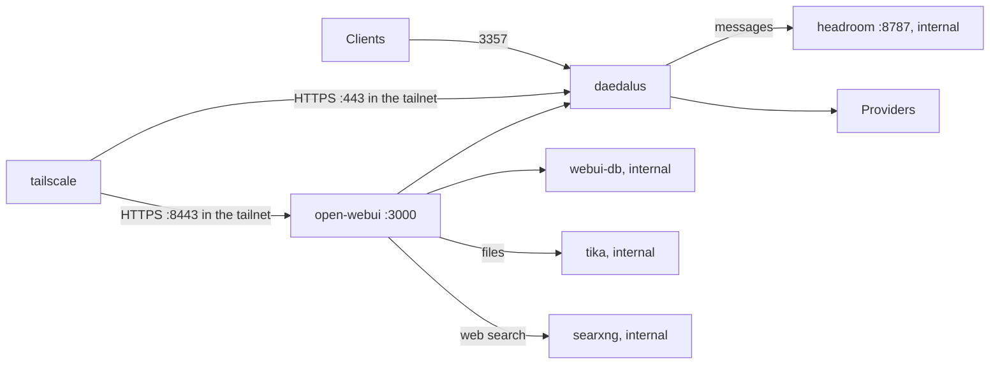

# Deployment

The reference deployment is a Raspberry Pi 4B with 8 GB of RAM. The compose file uses `slim` Docker images where they exist, to save space.

## Docker Compose

The install scripts do a check of Docker and `.env`, then build and start the container. See the [README](../README.md#quick-start).

The commands below are the same in cmd, PowerShell and bash.

| Task | Command |
| --- | --- |
| Start or update | `docker compose up -d --build` |
| Stop | `docker compose down` |
| Log | `docker compose logs -f daedalus` |
| Rebuild the catalog now | Click the Catalog chip in the dashboard header, or run `docker compose exec daedalus daedalus catalog` |

| Item | Value |
| --- | --- |
| Container | `daedalus`, with a health check on `/health` |
| Port | `3357` |
| State | `./.daedalus-state` (model store, API keys, weights, sessions) |
| Config | `./config`, read-write. The dashboard edits these files. |

## Optional services

Set `COMPOSE_PROFILES` in `.env`, for example `COMPOSE_PROFILES=webui,headroom`. Then `docker compose up -d` starts them.

| Profile | Service | What it does |
| --- | --- | --- |
| `webui` | `open-webui` | Chat UI on `http://localhost:3000`, and on port 8443 with the `tailscale` profile. It uses Daedalus as its OpenAI API. Its vector database `webui-db` (PostgreSQL with pgvector) has no host port. |
| `tika` | `tika` | Reads PDF and Office files for Open WebUI, with OCR. No port on the host. |
| `search` | `searxng` | Web search for Open WebUI. No port on the host, no key. |
| `headroom` | `headroom` | Compresses the messages before Daedalus sends them. No port on the host. |
| `tailscale` | `tailscale` | Publishes Daedalus and Open WebUI to your tailnet over HTTPS. |

### Open WebUI

| Setting | Value |
| --- | --- |
| API base | `http://daedalus:3357/v1` |
| API key | `OPENWEBUI_API_KEY`, else `DAEDALUS_MASTER_KEY` |
| First user | Becomes the Open WebUI admin |
| `ENABLE_FORWARD_USER_INFO_HEADERS` | `true`. Sends the chat id for [try again](architecture.md#try-again). It also sends the user name, id, e-mail and role. |
| `WEBUI_SECRET_KEY` | From `.env`. Without it, each new container makes a new key, and all logins end. |
| `AIOHTTP_CLIENT_TIMEOUT` | `600`, the same as `timeouts.request`. The Open WebUI default is 300 s. |
| `TASK_MODEL_EXTERNAL` | `daedalus/auto`, for titles, tags and follow-ups |
| `AUDIO_STT_ENGINE`, `AUDIO_STT_MODEL` | `openai` and `daedalus/graphos`. Speech to text goes to Daedalus, not to a local Whisper. |
| `ENABLE_IMAGE_GENERATION`, `IMAGE_GENERATION_MODEL` | `true` and `daedalus/photos` |
| `VECTOR_DB`, `PGVECTOR_DB_URL` | `pgvector` in `webui-db`, for files, knowledge and memory. `main-slim` supports no other vector store. |
| `RAG_EMBEDDING_ENGINE`, `RAG_EMBEDDING_MODEL` | `openai` and `mistral/mistral-embed` through Daedalus. `main-slim` has no local embedding model. A new embedding model needs a new index of all files. |
| `CONTENT_EXTRACTION_ENGINE` | `tika`. Plain text files do not go to Tika. Without the `tika` profile, PDF and Office files fail. |
| `ENABLE_WEB_SEARCH`, `WEB_SEARCH_ENGINE` | `true` and `searxng`. Without the `search` profile, a web search fails. |
| Spoken replies | The browser voice. Each user picks Web API or Kokoro.js in **Settings → Audio**. Open WebUI sends 1 speech request for each sentence, and the free Gemini TTS allows 3 requests per minute. |
| `RAG_EMBEDDING_BATCH_SIZE`, `ENABLE_ASYNC_EMBEDDING` | `32` and `false`: 32 chunks in each request, 1 request at a time, to stay below the free Mistral limits |

Open WebUI reads most of these settings only on the first start with a new data volume. After that, the values in **Admin Settings** apply. On an existing install, set them there.

Keep **Function Calling** on **Native**, the Open WebUI default since v0.10.0. Native sends the tools in `tools`, and Daedalus skips the models that cannot call tools. Legacy puts the tools in the prompt and calls tools only 1 time, before the answer.

### Tika

| Setting | Value |
| --- | --- |
| Image | `apache/tika:3.3.0.0-full`, with Tesseract OCR. Open WebUI uses the Tika 3 API by default. |
| Process | 1 Java process (`-noFork`) with a 512 MB heap |
| Out of memory | Java stops, and Docker starts Tika again |
| OCR | Pages with almost no text go to Tesseract, on the Pi CPU. 1 scanned page can take many seconds. |
| Compose | `required: false` in the Open WebUI `depends_on`, so the `webui` profile starts without Tika. It needs Compose 2.20 or later. |

### SearXNG

| Setting | Value |
| --- | --- |
| Image | `searxng/searxng:2026.9.25-12f8b6515` |
| Settings | `searxng/settings.yml`: JSON results on, the limiter off, so no Valkey |
| `SEARXNG_SECRET` | From `.env`. Empty by default: SearXNG has no host port, and the image proxy is off. |
| When it searches | With Native function calling, the model decides. Tell it to search the web when it does not. |
| Blocks | SearXNG sends each query to public search engines. They can block the Pi address or show a CAPTCHA. |

### Headroom

| Setting | Value |
| --- | --- |
| Mode | `lossy_inline` |
| Timeout | 5 s. Then the original messages go to the provider. |
| Failure | Daedalus sends the original messages. |
| Log | `saved=N` shows the saved tokens. |
| `HEADROOM_BEACON` | `off`. The anonymous upload of compression stats, on by default. |
| `HEADROOM_UPDATE_CHECK` | `off`. Compose pins the image version. |

Headroom is worth it for long agentic tasks. So far, it keeps token use lower with the same model quality.

### Tailscale

| Setting | Value |
| --- | --- |
| Auth key | `TS_AUTHKEY` |
| Device name | `TS_HOSTNAME`, default `daedalus` |
| Daedalus | `https://NAME.TAILNET.ts.net` |
| Open WebUI | `https://NAME.TAILNET.ts.net:8443`, when the `webui` profile runs. Browsers give the microphone only to HTTPS pages, so voice input on a phone needs this address. |
| Funnel | Off: only your tailnet can connect. |
| `TS_AUTH_ONCE` | `true`. The state volume keeps the login, so a used or old auth key does not stop a restart. |
| Health | `/healthz` on `127.0.0.1:9002`. `docker ps` shows "unhealthy" when the device has no tailnet address. |
