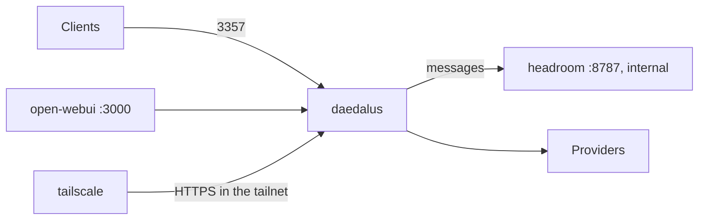

# Deployment

I run Daedalus on a Raspberry Pi 4B with 8GB RAM. Made sure to use the `slim` variants for Docker images to save space.

## Docker Compose

The install scripts do a check of Docker and `.env`, then build and start the container. See the [README](../README.md#quick-start).

The commands below are the same in cmd, PowerShell and bash.

| Task | Command |
| --- | --- |
| Start or update | `docker compose up -d --build` |
| Stop | `docker compose down` |
| Log | `docker compose logs -f daedalus` |
| Rebuild the catalog now | `docker compose exec daedalus daedalus catalog` |

| Item | Value |
| --- | --- |
| Container | `daedalus`, with a health check on `/health` |
| Port | `3357` |
| State | `./.daedalus-state` (model store, API keys, weights, sessions) |
| Config | `./config`, read-write. The dashboard edits these files. |

## Optional services

Set `COMPOSE_PROFILES` in `.env`, for example `COMPOSE_PROFILES=webui,headroom`. Then `docker compose up -d` starts them.

| Profile | Service | What it does |
| --- | --- | --- |
| `webui` | `open-webui` | Chat UI on `http://localhost:3000`. It uses Daedalus as its OpenAI API. |
| `headroom` | `headroom` | Compresses the messages before Daedalus sends them. No port on the host. |
| `tailscale` | `tailscale` | Publishes only Daedalus to your tailnet over HTTPS. |

### Open WebUI

| Setting | Value |
| --- | --- |
| API base | `http://daedalus:3357/v1` |
| API key | `OPENWEBUI_API_KEY`, else `DAEDALUS_MASTER_KEY` |
| First user | Becomes the Open WebUI admin |

> Q: Which Open WebUI settings do you recommend with Daedalus? For example: the task model, or the function calling mode.

### Headroom

| Setting | Value |
| --- | --- |
| Mode | `lossy_inline` |
| Timeout | 5 s. Then the original messages go to the provider. |
| Failure | Daedalus sends the original messages. |
| Log | `saved=N` shows the saved tokens. |

Headroom is worth it for long agentic tasks. Keeps your token usgae lower than without with the same model performance, at least so far.

### Tailscale

| Setting | Value |
| --- | --- |
| Auth key | `TS_AUTHKEY` |
| Device name | `TS_HOSTNAME`, default `daedalus` |
| Address | `https://NAME.TAILNET.ts.net` |
| Funnel | Off: only your tailnet can connect. |
