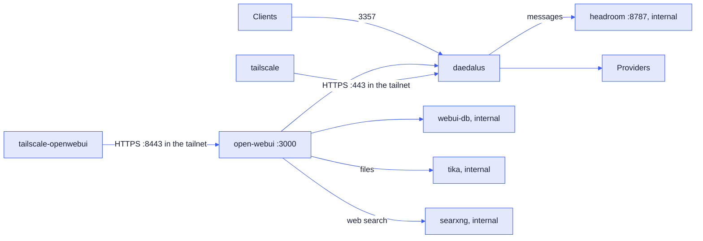

# Deployment

The reference deployment is a Raspberry Pi 4B with 8 GB of RAM. The compose file uses `slim` Docker images where they exist, to save space.

## Docker Compose

The install scripts show what they install or download and ask `[y/N]` before a change. Then they install Docker if it is missing: Docker Desktop with winget on Windows, or `get.docker.com` on Linux. Outside a git checkout, they download the files of the newest `v*` tag, else `main`, to the `daedalus` folder in the home folder. They copy only missing files, so `.env` and `config/` stay.

They make `.env` with a new master key, then pull the daedalus image and start the containers.
With `--dev`, they use `compose.dev.yml`: they build the image from the source when the source is in
the folder, and they pull `ghcr.io/nemoe7/daedalus:dev` when it is not. See the
[README](../README.md#quick-start).

The commands below are the same in cmd, PowerShell and bash.

| Task | Command |
| --- | --- |
| Start | `docker compose up -d` |
| Update | `git pull`, then `docker compose pull`, then `docker compose up -d` |
| Build from the source | `compose.dev.yml` builds `daedalus:dev` from the source at each start, with each command. Needs the source in the folder. |
| Run the dev image | `install --dev` outside a checkout pulls `ghcr.io/nemoe7/daedalus:dev` at each start. It downloads the files of `main`. |
| Stop | `docker compose down` |
| Log | `docker compose logs -f api` |
| Rebuild the catalog now | The Catalog chip in the dashboard header, or `docker compose exec api daedalus catalog` |
| Dump catalogs/models | `docker compose exec api daedalus dump catalog`, `models`, or `all`. Files go to `.daedalus-state/dump` |

`dump` defaults to JSON. Add `-f csv` (also `--fmt` or `--format`) for CSV. Catalog refresh saves provider snapshots. Every dump reads those snapshots and never fetches.

Saving provider YAML in the dashboard rebuilds the model list from cache. After editing files outside the dashboard, click Catalog to fetch and rebuild.

| Item | Value |
| --- | --- |
| Container | `daedalus-api`, with the health check of the image on `/health` |
| Image | `ghcr.io/nemoe7/daedalus:latest`, for `linux/amd64` and `linux/arm64` |
| Port | `3357` |
| State | `./.daedalus-state` (model store, API keys, weights, sessions) |
| Config | `./config`, read-write. The dashboard edits these files. |

## Image release

A successful **Gemini Release Draft** approval starts the `release` job of `.github/workflows/docker.yml` with the approved `v*` tag. The workflow publishes `ghcr.io/nemoe7/daedalus:TAG` and `ghcr.io/nemoe7/daedalus:latest`. A proposal-only Gemini run does not build an image. A manual image build is also available from the Actions tab.

| Task | Command |
| --- | --- |
| Release | Run **Gemini Release Draft** and approve it. The approval tags `v*` and builds the image. |
| Manual image build | Run **Docker** in the Actions tab, pick `release`, and enter an existing `v*` tag. |
| Use 1 release | Set `image:` of `daedalus` in `compose.yml` to `ghcr.io/nemoe7/daedalus:v0.1.0`. |

## Dev image

A successful **CI** run on `main` starts the `dev` job of `.github/workflows/docker.yml`. It publishes
`ghcr.io/nemoe7/daedalus:dev` and `ghcr.io/nemoe7/daedalus:dev-COMMIT`, and it keeps the newest 10
`dev-COMMIT` versions. It never publishes `latest`, and it never deletes a `v*` version. A push that
changes no file under the CI paths starts no build.

| Task | Command |
| --- | --- |
| Dev image | Push to `main`. CI passes, then **Docker** publishes `dev`. |
| Manual dev image build | Run **Docker** in the Actions tab and pick `dev`. |
| Use the dev image | `install --dev` outside a git checkout, or `image: ghcr.io/nemoe7/daedalus:dev` in `compose.yml`. |

The dev image tracks `main`. Its code has no review. Use it to test the newest commits, not to run a
release.

## Optional services

Set `COMPOSE_PROFILES` in `.env`. For example, `COMPOSE_PROFILES=webui,tailscale-openwebui,headroom` starts Open WebUI, its separate Tailscale service, and Headroom.

| Profile | Service | What it does |
| --- | --- | --- |
| `webui` | `open-webui`, `webui-db` | Chat UI on `http://localhost:3000`, with daedalus as its OpenAI API. |
| `tika` | `tika` | Reads PDF and Office files for Open WebUI, with OCR. No port on the host. |
| `search` | `searxng` | Web search for Open WebUI. No port on the host, no key. |
| `headroom` | `headroom` | Compresses the messages before daedalus sends them. No port on the host. |
| `tailscale` | `tailscale` | Publishes daedalus to your tailnet over HTTPS. |
| `tailscale-openwebui` | `tailscale-openwebui` | Publishes Open WebUI to its own Tailscale device over HTTPS. The `webui` profile enables it. |

The installers ask for profiles only when `.env` is absent. If you decline Open WebUI, they skip Tika, SearXNG search, and Open WebUI Tailscale. Updates keep the existing `COMPOSE_PROFILES` value.

### Open WebUI

| Setting | Value |
| --- | --- |
| API base | `http://api:3357/v1` |
| API key | `OPENWEBUI_API_KEY`, else `DAEDALUS_MASTER_KEY` |
| First user | Becomes the Open WebUI admin |
| `ENABLE_FORWARD_USER_INFO_HEADERS` | `true`. It sends the chat id and the user facts for [try again](architecture.md#try-again). |
| `WEBUI_SECRET_KEY` | From `.env`. Without it, each new container makes a new key, and all logins end. |
| `AIOHTTP_CLIENT_TIMEOUT` | `600`, the same as `timeouts.request`. The Open WebUI default is 300 s. |
| `TASK_MODEL_EXTERNAL` | `daedalus/auto`, for titles, tags and follow-ups |
| `AUDIO_STT_ENGINE`, `AUDIO_STT_MODEL` | `openai` and `daedalus/graphos`. Speech to text goes to daedalus, not to a local Whisper. |
| `ENABLE_IMAGE_GENERATION`, `IMAGE_GENERATION_MODEL` | `true` and `daedalus/photos` |
| `ENABLE_IMAGE_EDIT`, `IMAGE_EDIT_ENGINE`, `IMAGE_EDIT_MODEL` | `true`, `openai` and `daedalus/photos`. Only the photos models with image input edit. |
| `AUDIO_STT_OPENAI_API_*`, `IMAGES_OPENAI_API_*`, `IMAGES_EDIT_OPENAI_API_*` | The daedalus API base and key. Without them, speech and images go to OpenAI. |
| `VECTOR_DB`, `PGVECTOR_DB_URL` | `pgvector` in `webui-db`, for files, knowledge and memory. `main-slim` supports no other vector store. |
| `RAG_EMBEDDING_ENGINE`, `RAG_EMBEDDING_MODEL` | `openai` and `mistral/mistral-embed` through daedalus. `main-slim` has no local embedding model. |
| `CONTENT_EXTRACTION_ENGINE` | `tika`. Without the `tika` profile, PDF and Office files fail. Plain text skips it. |
| `ENABLE_WEB_SEARCH`, `WEB_SEARCH_ENGINE` | `true` and `searxng`. Without the `search` profile, a web search fails. |
| `DEFAULT_MODEL_METADATA` | On in each new chat. An existing install: **Admin Settings → Models → Defaults**. |
| MCP servers | MCP tools need **Native** function calling. Tool requests skip the models without it. See [MCP](https://docs.openwebui.com/features/extensibility/mcp/). |
| Spoken replies | **Settings → Audio**: Web API or Kokoro.js. Gemini TTS allows 3 requests per minute. |
| `RAG_EMBEDDING_BATCH_SIZE`, `ENABLE_ASYNC_EMBEDDING` | `32` and `false`: 32 chunks in each request, serial, for the free Mistral limits |

After a change of `pools.audio` or `pools.images` in `config/daedalus.yml`, change `daedalus/graphos` or `daedalus/photos` in `compose.yml` and in **Admin Settings**. Also change the pool names in the Kilo and Open WebUI model settings.

Open WebUI reads most of these settings only on the first start with a new data volume. After that, the values in **Admin Settings** apply. On an existing install, set them there.

To check the services and settings:

1. `docker compose exec open-webui curl -s "http://searxng:8080/search?q=test&format=json" | head -c 200` shows JSON.
2. `docker compose exec open-webui curl -s http://tika:9998/version` shows the Tika version.
3. **Admin Settings → Documents** shows Tika at `http://tika:9998`, and embeddings `OpenAI` with `mistral/mistral-embed`.
4. **Admin Settings → Web Search** shows `searxng`. **Code Execution** shows the code interpreter on, with `pyodide`.
5. **Admin Settings → Audio** and **Images** show `http://api:3357/v1`. **Images** shows **Image Edit** on, with `daedalus/photos`. An older database keeps its values: set them there.
6. Upload a PDF in a chat. The daedalus log shows `/v1/embeddings` requests.

| Feature | Tools for the model | Condition |
| --- | --- | --- |
| Web search | `search_web`, `fetch_url` | **Web Search** is on at the start of each chat. |
| Files | none | Tika reads the file at upload. Open WebUI adds the matching parts to the prompt. |
| Code | `execute_code` | On at the start of each chat. The code runs in the browser (Pyodide). |

Keep **Function Calling** on **Native**, the Open WebUI default since v0.10.0. Native sends the tools in `tools`, and daedalus skips the models that cannot call tools. Legacy puts the tools in the prompt and calls tools only 1 time, before the answer.

#### Deep research skill

`integrations/openwebui/deep-research.md` is an Open WebUI skill: plain instructions, no code. The model plans, searches in 3 to 5 rounds with `search_web`, reads pages with `fetch_url`, and writes a report with numbered sources. Each step is a normal chat request, so daedalus failover and loop checks apply.

1. **Workspace → Skills**, the arrow next to **Create**, **Import JSON**. Select `deep-research.md`, then **Save**.
2. **Access** on the skill: make it public, or give read access to each user. A user without read access does not receive the skill.
3. **Workspace → Models**, **Create**: base model `daedalus/sophos`, name `Deep Research`. In **Skills**, select `deep-research`. **Save**.
4. In a chat with `Deep Research`, keep **Web Search** on. Use `$deep-research` in a chat with another model.

#### GitHub tool

`integrations/openwebui/github.py` is an Open WebUI Workspace Tool: one Python file, standard library only, empty `requirements`. It holds the GitHub surface of the reference connector. Reads run at once. Each write asks for confirmation in the chat. 3 tools sit outside the connector list. `create_pr_with_files` writes a file list as 1 commit and opens or updates the pull request. `list_commits` reads the history of a path or a branch. `list_tree` reads the whole tree in 1 call.

3 security reads cover the alert lists: `code_scanning_alerts`, `secret_scanning_alerts` and `dependabot_alerts`. Each lists with filters, or reads 1 alert with its instances or locations. They need a token with the `security_events` scope, or the matching fine-grained read. Without it GitHub answers 403.

2 CI reads cover the checks. `check_runs` lists the check runs of a ref with the name, the status and the filter, or reads 1 run with its annotations. `list_workflows` lists the Actions workflows.

4 more reads ship. `actions_minutes` reads the Actions minutes of an org or a user. `releases` lists the releases, or reads 1 by id or tag. `tags` lists the tags. `packages` reads the packages of the signed-in user, a user or an org.

Gist management ships as 5 tools: `gists`, `fetch_gist`, and the gated writes `create_gist`, `update_gist` and `delete_gist`.

The 3 alert reads take gated writes: `update_code_scanning_alert`, `update_secret_scanning_alert` and `update_dependabot_alert` dismiss, resolve or reopen an alert.

1. **Workspace → Tools**, **Create**, paste the file, **Save**.
2. **Valves**: set `github_token`, or set the `GITHUB_TOKEN` environment value. Keep `default_mode` `ask`.
3. **Access** on the tool: make it public, or give read access to each user. A user without read access does not see the tool.

| Valve | Default | Meaning |
| --- | --- | --- |
| `github_token` | empty | The token. `GITHUB_TOKEN` is the fallback. |
| `default_mode` | `ask` | `ask` gates each write, `allow` skips the dialog, `deny` refuses each write. |
| `timeout_seconds` | `60` | The wait for the confirmation. A closed tab, no dialog, or a late answer reads as no. |
| `http_timeout_seconds` | `30` | The GitHub HTTP timeout. |
| `api_version` | `2022-11-28` | The `X-GitHub-Api-Version` header. |
| `max_files_per_commit` | `30` | The file limit of `create_pr_with_files`. |
| `max_tree_entries` | `2000` | The entry limit of `list_tree`. |

`UserValves.mode` gives each user `ask`, `allow`, `deny`, or `default` for the valve. `UserValves.timeout_seconds` gives each user their own confirmation wait. A value of `0` keeps the valve.

The confirmation travels over the socket of the chat tab. `WEBSOCKET_EVENT_CALLER_TIMEOUT` is unset by default, so the Open WebUI server waits without a timeout when the browser does not answer. Only `timeout_seconds` ends that wait. A page refresh drops the dialog, the tool returns `denied: true`, and it sends nothing.

`tests/integrations/test_owui_github_tool.py` holds the tool surface, the gate and the error path.

### Open WebUI database

The `webui` profile starts `webui-db` with Open WebUI.

| Setting | Value |
| --- | --- |
| Image | `pgvector/pgvector:0.8.6-pg18-trixie` |
| Content | The vectors of files, knowledge and memory. The chats stay in the `open-webui` volume. |
| Password | `OPENWEBUI_DB_PASSWORD`, default `openwebui`. No port on the host. |
| Vector size | 1024, the size of a `mistral/mistral-embed` vector. A new model needs a new index. |
| Volume | `webui-db` |

### Tika

| Setting | Value |
| --- | --- |
| Image | `apache/tika:3.3.0.0-full`, with Tesseract OCR. Open WebUI uses the Tika 3 API by default. |
| Process | 1 Java process (`-noFork`) with a 512 MB heap |
| Out of memory | Java stops, and Docker starts Tika again |
| OCR | Tesseract reads the text-poor pages on the Pi CPU. 1 scanned page takes many seconds. |
| Compose | `required: false` in the Open WebUI `depends_on`: `webui` starts without Tika. Compose 2.20 or later. |

### SearXNG

| Setting | Value |
| --- | --- |
| Image | `searxng/searxng:2026.9.25-12f8b6515` |
| Settings | `services/searxng/settings.yml`: JSON results on, the limiter off, so no Valkey |
| `SEARXNG_SECRET` | From `.env`. Empty by default: no SearXNG host port, the image proxy off. |
| When it searches | With Native function calling, the model decides. Tell it to search when it does not. |
| Blocks | SearXNG queries public search engines. They can block the Pi address or show a CAPTCHA. |

### Headroom

| Setting | Value |
| --- | --- |
| Mode | `lossy_inline` |
| Timeout | 5 s. Then the original messages go to the provider. |
| Failure | daedalus sends the original messages. |
| Log | `saved=N` shows the saved tokens. |
| `HEADROOM_BEACON` | `off`. The anonymous upload of compression stats, on by default. |
| `HEADROOM_UPDATE_CHECK` | `off`. Compose pins the image version. |

Headroom is worth it for long agentic tasks. So far, it keeps token use lower with the same model quality.

### Tailscale

| Setting | Value |
| --- | --- |
| Auth key | `TS_AUTHKEY` for daedalus. `TS_AUTHKEY_OWUI` for Open WebUI, with a `TS_AUTHKEY` fallback. |
| Device name | `TS_HOSTNAME`, default `daedalus`. `TS_HOSTNAME_OWUI`, default `owui`. |
| daedalus | `https://TS_HOSTNAME.TAILNET.ts.net` |
| Open WebUI | `https://TS_HOSTNAME_OWUI.TAILNET.ts.net:8443`, with the `webui` and `tailscale-openwebui` profiles. A phone microphone needs the HTTPS. |
| Funnel | Off: only your tailnet can connect. |
| `TS_AUTH_ONCE` | `true`. The state volume keeps the login across restarts, old auth keys included. |
| Health | `/healthz` on `127.0.0.1:9002`. `docker ps` shows "unhealthy" when the device has no tailnet address. |
