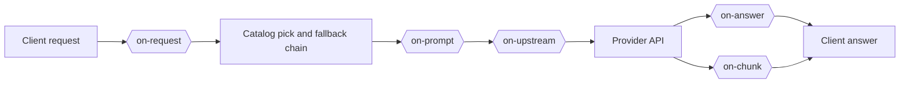
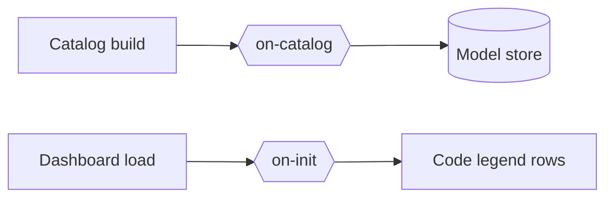

# Hooks

A hook is Python code that changes the catalog rows, chat requests and answers of a provider or a model. A `hooks` list names the hook files:

```yaml
openrouter:
  hooks:
    - on-upstream: hooks/openrouter_only.py
  models:
    z-ai/glm-5.3-flash:
      hooks:
        - on-catalog: hooks/or_cheapest_output.py
        - on-upstream: hooks/or_cheapest_output.py
```

The `hooks` key works like `order`. A `models` entry has priority. Then comes the provider block in the `{provider}.yml` file of the model, then the provider block in the main file. A model with `hooks: []` uses no hooks.

Each item has 1 hook surface and 1 file path. The path starts in the [`config`](../config) folder, and the file must stay in that folder. The usual path is `hooks/name.py`, under the folder of `hooks.dir`. An installed file joins a surface without a line here, from its own `surfaces` block.

## Contents

- [Hook surfaces](#hook-surfaces)
- [The HTTP surface](#the-http-surface)
- [Errors](#errors)
- [Logs](#logs)
- [Changes](#changes)
- [The hook folder](#the-hook-folder)
- [Sources and the lock](#sources-and-the-lock)
- [The CLI](#the-cli)
- [The Settings page](#the-settings-page)
- [The shipped hook files](#the-shipped-hook-files)
- [New hook surfaces](#new-hook-surfaces)

## Hook surfaces

For each surface, the file defines 1 function with the name of the surface.

The first chart follows a chat request. The second shows the catalog build and the dashboard load.





### `on-request`

Before the chain of a chat request, and again on a repeat with the count.

`on_request(value, model, headers)`

| Argument | Value |
| --- | --- |
| `value` | `key` (`None`), `digest`, the hash of the messages without the system rows, and on the second run `count` |
| `model` | The requested model |
| `headers` | The client headers |

### `on-catalog`

At each catalog build, for each model with the hook, before the store write.

`on_catalog(row, model, api_base, headers)`

| Argument | Value |
| --- | --- |
| `row` | A catalog row. The id cannot change |
| `api_base`, `headers` | The values for the provider API calls |

### `on-prompt`

Before the first attempt of a chat request, when the chain holds a reasoning model.

`on_prompt(value, messages, prompt, model, tier, tier_name, slot, reasoning, effort, retry, level, body, config, key, app)`

| Argument | Value |
| --- | --- |
| `value` | The dict the hook files change, empty at the start |
| `reasoning` | The chain models that support reasoning |
| `effort` | The value of the client, `None` when it sent none |
| `retry` | The count of try agains of this message, `0` for its first answer |
| `level` | The reasoning level of the last answer of the chat, `None` when the chat has none |
| `app` | The client app of the request, `OWUI`, `Kilo` or another title, from its headers |

### `on-upstream`

Before each chat request to the provider, streams and fallbacks included.

`on_upstream(body, model, headers)`

| Argument | Value |
| --- | --- |
| `body` | The upstream JSON body, native format for native APIs |
| `model` | `provider/slug` |
| `headers` | Changeable |

### `on-answer`

After a full chat answer comes back, before the client gets it.

`on_answer(answer, model)`

| Argument | Value |
| --- | --- |
| `answer` | The answer in the OpenAI format. A stream has no `on-answer` surface |

### `on-chunk`

On each streamed chunk of a chat request, before the client gets it.

`on_chunk(chunk, model, context)`

| Argument | Value |
| --- | --- |
| `chunk` | 1 OpenAI chunk |
| `model` | The requested model |
| `context` | `previous` is the model of the last answer of the session. It is empty on the first answer |
| `attempts` | The failures so far |
| `code` | The retry code |
| `pool` | The landed pool |
| `served` | The landed model |

### `on-http`

On `POST /v1/hook/<file>`, for the file the path names.

`on_http(body, key, prompt, headers, pin, level)`

| Argument | Value |
| --- | --- |
| `body` | The JSON body of the call |
| `key` | The session key of the chat, from the bearer token and its first user turn |
| `prompt` | The first user turn |
| `headers` | The request headers |
| `pin` | The slot and the model of the last answer of the chat |
| `level` | The reasoning level of that answer. The route passes each when the file names the argument. It returns the dict of the JSON answer |

### `on-init`

At the dashboard load, for each enabled request hook file.

`on_init()`

No arguments. It returns the rows of the code legend of the dashboard, such as `[["rtN", "A repeat picked another model, N times"]]`.

A request-level surface, such as `on-request`, takes its files from the `hooks` group of [`config/daedalus.yml`](../config/daedalus.yml), because no provider owns the request yet. An installed file with a `surfaces` block in its frontmatter joins its surfaces without a key there:

```yaml
hooks:
  on-request: [hooks/owui_auto_reasoning_effort.py]
  on-prompt: [hooks/owui_auto_reasoning_effort.py]
  on-chunk: [hooks/served_model.py]
```

Each key holds a list of files, and they run in list order. 1 path on its own works too. An empty list turns that surface off.

The `on-init` surface has no group of its own: the dashboard reads the `on_init` function of each file of the folder. The legend card shows those rows below the base rows, and a file with no `on_init` adds no row.

A file that sets `value["key"]` counts the requests of that key: a repeat after an answer is a try again.

### The reasoning effort

The `on-prompt` surface hands each hook file the values of the request, and a hook file sets `reasoning_effort`. A hook
value wins over the client value and over the catalog default, and the base sets no effort of its
own. The shipped file steps aside for a client value on a new message, so a client keeps the last
word there. The levels and the shipped file are on the [auto reasoning effort](hooks/owui_auto_reasoning_effort.md) page.

`daedalus` then drops the models that answered the message: `daedalus/auto` steps the tier 1 step up, and a named pool keeps its pool. The surface runs again with `count` filled in. A file that writes `value["code"]` sets the code of the Requests row, such as `rt1`. Without a `key`, a repeat is a new request.

Without a `code`, the row shows no code. [`hooks/owui_auto_reasoning_effort.py`](../hooks/owui_auto_reasoning_effort.py) applies this rule to the `x-openwebui-chat-id` header of Open WebUI.
The media endpoints, transcription and images, count a repeat of the same content with no hook.
That count is the one repeat path of the base app.

A function gets a copy of the value. It can change the copy and return None, or it can return a new dict. The hooks of 1 surface run in list order, and each hook gets the value of the hook before it.

## The HTTP surface

A hook file can answer an HTTP call. The path names the file, and the file must sit under
`hooks`:

cmd:

```cmd
curl -X POST http://localhost:3357/v1/hook/example -H "Authorization: Bearer %DAEDALUS_KEY%" ^
  -H "Content-Type: application/json" -d "{\"messages\": [{\"role\": \"user\", \"content\": \"why is this slow\"}]}"
```

PowerShell:

```powershell
curl.exe -X POST http://localhost:3357/v1/hook/example -H "Authorization: Bearer $env:DAEDALUS_KEY" `
  -H "Content-Type: application/json" -d '{"messages": [{"role": "user", "content": "why is this slow"}]}'
```

bash:

```bash
curl -X POST http://localhost:3357/v1/hook/example -H "Authorization: Bearer $DAEDALUS_KEY" \
  -H "Content-Type: application/json" -d '{"messages": [{"role": "user", "content": "why is this slow"}]}'
```

The route loads the file, calls its `on_http`, and answers with the dict it returns. An error inside the
hook is a 500, and a missing file is a 404. Any valid key may call any hook file. Treat a hook file
as admin code: it runs in the process of daedalus with full access.

The shipped [`hooks/owui_auto_reasoning_effort.py`](../hooks/owui_auto_reasoning_effort.py)
names the turn of an Open WebUI chat, writes the `rtN` code of a repeat, and sets the reasoning level
of the request. Its page is [auto reasoning effort](hooks/owui_auto_reasoning_effort.md).

## Errors

A hook error does not stop the request. daedalus logs the error, and the value goes on without the changes of that hook. The next hook in the list still runs. These are errors:

- An exception, or a return value that is not a dict or None
- A file that is not there, does not load, or has no function for the surface
- A path outside the [`config`](../config) folder, or an unknown surface

## Logs

The base writes 1 line for each hook that runs, at `INFO`. The line holds the surface, the file, the model and
the value that the hook gave back. The `on-chunk` surface runs for each chunk of 1 answer. Its run line stays
at `DEBUG`, and a hook file of that surface writes the line of the answer.

The shipped files log their own decisions. A log line never changes the answer of a hook.

## Changes

daedalus reads a file again when its file time changes. A restart is not necessary.

Hooks get no database access. An `on-catalog` hook changes only the row. daedalus writes only the known columns of the row, so a hook cannot change a table. A hook that keeps data uses its own file, such as `cheapest_output.json`.

The dashboard edits the `hooks` list of a model or a provider. The Hooks card of the Settings page names the
folder, the sources and the files that load. Only the update writes a hook file, and it writes to the folder
of `hooks.dir`. The Delete button of a row leaves the file and its lock record out, and the settings entries
of the file stay.

A hook runs inside the daedalus process, with all its access.

## The hook folder

A hook file sits in the folder that `hooks.dir` names, under [`config`](../config). The default is
`hooks`, so the shipped files live in [`hooks`](../hooks). An installed file carries a
frontmatter block, so the manager knows its version and its scope without a run of the file:

```python
# ---
# name: served_model
# version: 1.3.0
# requires: ">=0.2"
# surfaces: [on-chunk]
# scope: global
# ---
```

| Key | Value | Use |
| --- | --- | --- |
| `name` | text | The file name without `.py` |
| `version` | text | The version of the file. The update line shows the old value and the new 1 |
| `requires` | version range | The daedalus version that the file needs. A mismatch warns 1 time and leaves the file out |
| `surfaces` | list of surface names | The functions of the file |
| `scope` | `global`, `provider`, `yaml` or `model` | Where the hook attaches |
| `targets` | list of names | The provider names or the model ids of a `provider`, `yaml` or `model` scope |
| `author` | text | The name of the author of the file |
| `title` | text | The short name of the hook |
| `description` | text | One line of what the hook does |
| `license` | text | The license of the file |

A file with no block still runs. The manager takes the name from the file name, applies no scope, and
writes 1 warning line. The scope rules:

1. `global` runs the hook for every model and for every request surface.
2. `provider` runs the hook when the name of the model holds 1 of the targets.
3. `yaml` runs the hook for the models that the `{provider}.yml` file of 1 of the targets names in
   its `models`. The main provider file stays out.
4. `model` runs the hook for the named model ids alone.
5. A request surface accepts `provider`, `yaml` and `model` too.
6. `on-http` needs no scope, because the route names the file.

## Sources and the lock

The `hooks.sources` list brings the hook files from GitHub:

```yaml
hooks:
  dir: hooks
  sources:
    - repo: nemoe7/daedalus-hooks
      path: hooks
      ref: main
      auto_update: false
  disabled: []
```

| Key | Value | Use |
| --- | --- | --- |
| `repo` | `owner/name` or a GitHub URL | The repository of the hook files |
| `path` | 1 folder in the repo | The folder that holds the `.py` files. daedalus reads the files directly under it |
| `ref` | 1 branch, a tag or a commit | `main` by default |
| `auto_update` | true or false | `true` follows the ref at each start. `false`, the default, leaves each file to the Take button |

A start reads a source that sets `auto_update`. The Settings card lists a source, and its Take button
writes the picked files. An update reads the commit of the ref,
reads the archive of that commit, and writes each file through a temporary name.
A request that fails, an archive that does not read, a refused block or a failed write all keep the
files on disk.

The lock in [`hooks.lock.json`](../config) records the sha256, the version, the repo and the
commit of each installed file. A file that leaves the repo stays on disk with its record. An
installed file runs at a surface when its block names that surface, its scope matches the model, and
`hooks.disabled` does not hold its name.

## The CLI

```bash
daedalus hooks update                       # every source of hooks.sources
daedalus hooks update nemoe7/daedalus-hooks # the sources of 1 repo
daedalus hooks list                         # the file, the version, the scope and the state of each
daedalus hooks verify                       # the disk against the lock
```

`hooks verify` loads each file in its own process, with a 10 second limit. It prints 1 line for each
file: `ok`, `unpinned`, `warn` or `bad`. Only `bad` sets the exit code 1, so a script can gate on it.

Inside the Docker image, the `daedalus` command sits on the path of the container, so no shell and
no install are necessary:

```bash
docker compose exec api daedalus hooks update
docker exec daedalus-api daedalus hooks verify
```

## The Settings page

The Hooks card of the Settings page holds the folder, the sources and 1 switch per installed file. `Update
from the sources` reads the same sources as `daedalus hooks update`, and names the old version and the new 1
of each file that moved. `+ Add a repo` opens 1 modal for the repo URL. The scan then lists the files of that
repo, each with its own switch, so the operator takes some files and leaves the rest.

The `×` of the source row deletes the picked source.

A hook row of a provider card or of a model entry offers the installed files whose scope fits that
card. The keyword chips of the Hooks card accept any file of the folder.

## The shipped hook files

| File | What it does |
| --- | --- |
| [`hooks/owui_auto_reasoning_effort.py`](../hooks/owui_auto_reasoning_effort.py) | The [auto reasoning level and try-again rule](hooks/owui_auto_reasoning_effort.md) of an Open WebUI chat |
| [`hooks/served_model.py`](../hooks/served_model.py) | The [served model line](hooks/served_model.md) of a chat pool request |
| [`hooks/or_cheapest_output.py`](../hooks/or_cheapest_output.py) | The [OpenRouter endpoint order](hooks/or_cheapest_output.md) |

[`hooks/example.py`](../hooks/example.py) is the start for a new hook file. The
[README](../README.md#hooks) holds its description and 1 example.

## New hook surfaces

A model surface is 1 item in `SURFACES` in [`daedalus/providers/hooks.py`](../daedalus/providers/hooks.py), and 1 `hooks.run` call where the value is ready. A request surface is also 1 key in the `hooks` group of the settings, and 1 `hooks.run_request` call.
