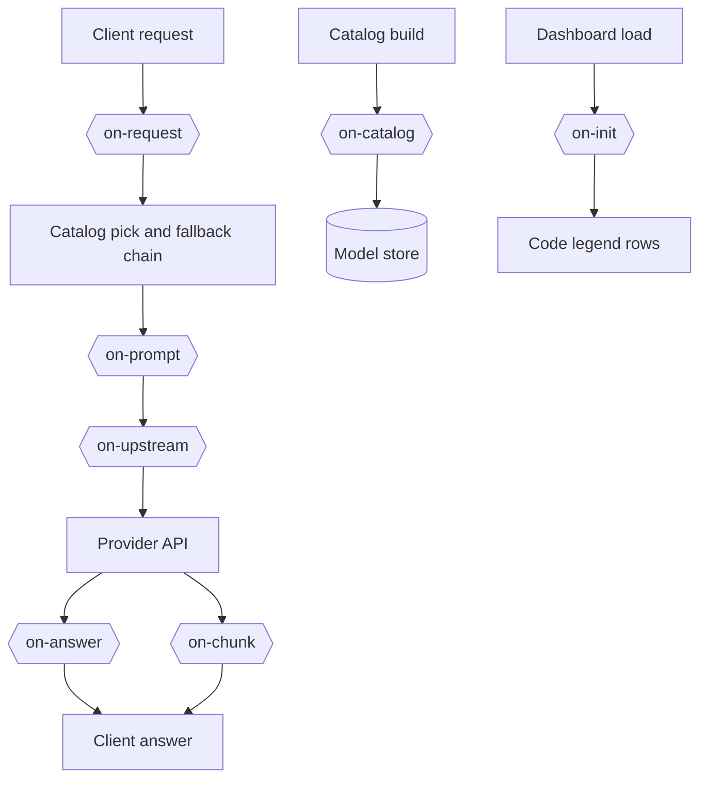

# Hooks

A hook is Python code that changes the catalog rows, chat requests and answers of a provider or a model. A `hooks` list names the hook files:

```yaml
openrouter:
  hooks:
    - on-upstream: hooks/openrouter_only.py
  models:
    z-ai/glm-5.3-flash:
      hooks:
        - on-catalog: hooks/or_cheapest_output.py
        - on-upstream: hooks/or_cheapest_output.py
```

The `hooks` key works like `order`. A `models` entry has priority. Then comes the provider block in the `{provider}.yml` file of the model, then the provider block in the main file. A model with `hooks: []` uses no hooks.

Each item has 1 hook point and 1 file path. The path starts in the [`config`](../config) folder, and the file must stay in that folder. The file name can be any name.

## Hook points

For each point, the file defines 1 function with the name of the point.

| Point | Function | When | Gets |
| --- | --- | --- | --- |
| `on-request` | `on_request(value, model, headers)` | Before the chain of a chat request, and again on a repeat with the count | `value`: `key` (`None`), `digest`, the hash of the messages without the system rows, and on the second run `count`. `model`: the requested model. `headers`: the client headers. |
| `on-catalog` | `on_catalog(row, model, api_base, headers)` | At each catalog build, for each model with the hook, before the store write | `row`: a catalog row, the id cannot change. `api_base`, `headers`: for the provider API calls. |
| `on-prompt` | `on_prompt(value, messages, prompt, model, tier, tier_name, slot, reasoning, effort, retry, level, body, config, key, app)` | Before the first attempt of a chat request, when the chain holds a reasoning model | `value`: the dict the hook files change, empty at the start. `reasoning`: the chain models that support reasoning. `effort`: the value of the client, `None` when it sent none. `retry`: the count of try agains of this message, `0` for its first answer. `level`: the reasoning level of the last answer of the chat, `None` when the chat has none. `app`: the client app of the request, `OWUI`, `Kilo` or another title, from its headers. |
| `on-upstream` | `on_upstream(body, model, headers)` | Before each chat request to the provider, streams and fallbacks included | `body`: the upstream JSON body, native format for native APIs. `model`: `provider/slug`. `headers`: changeable. |
| `on-answer` | `on_answer(answer, model)` | After a full chat answer comes back, before the client gets it | `answer`: the answer in the OpenAI format. A stream has no `on-answer` point. |
| `on-chunk` | `on_chunk(chunk, model, context)` | On each streamed chunk of a chat request, before the client gets it | `chunk`: 1 OpenAI chunk. `model`: the requested model. `context`: `previous` is the model of the last answer of the session. It is empty on the first answer. `attempts`: the failures so far. `code`: the retry code. `pool`: the landed pool. `served`: the landed model. |
| `on-http` | `on_http(body, key, prompt, headers, pin, level)` | On `POST /v1/hook/<file>`, for the file the path names | `body`: the JSON body of the call. `key`: the session key of the chat, from the bearer token and its first user turn. `prompt`: the first user turn. `headers`: the request headers. `pin`: the slot and the model of the last answer of the chat. `level`: the reasoning level of that answer. The route passes each when the file names the argument. It returns the dict of the JSON answer. |
| `on-init` | `on_init()` | At the dashboard load, for each enabled request hook file | No arguments. It returns the rows of the code legend of the dashboard, such as `[["rtN", "A repeat picked another model, N times"]]`. |



A request-level point, such as `on-request`, takes its files from the `request_hooks` group of [`config/daedalus.yml`](../config/daedalus.yml), because no provider owns the request yet:

```yaml
request_hooks:
  on-request: [hooks/owui_retry.py]
  on-prompt: []
  on-chunk: [hooks/served_model.py]
```

Each key holds a list of files, and they run in list order. 1 path on its own works too. An empty list turns that point off. The `on-init` point has no group of its own: the dashboard reads the `on_init` function of each file in `request_hooks`. The legend card shows those rows below the base rows, and a file with no `on_init` adds no row. A file that sets `value["key"]` counts the requests of that key: a repeat after an answer is a try again.

### The reasoning effort

The `on-prompt` point hands each hook file the values of the request, and a hook file sets
`reasoning_effort`. The client keeps the last word, and the base sets no effort of its own. The 3
levels, the shipped ladder file and its route are on the [think longer](hooks/owui_think_longer.md) page.

`daedalus` then drops the models that answered the message: `daedalus/auto` steps the tier 1 step up, and a named pool keeps its pool. The point runs again with `count` filled in. A file that writes `value["code"]` sets the code of the Requests row, such as `rt1`. Without a `key`, a repeat is a new request.

Without a `code`, the row shows no code. [`config/hooks/owui_retry.py`](../config/hooks/owui_retry.py) applies this rule to the `x-openwebui-chat-id` header of Open WebUI.
The media endpoints, transcription and images, count a repeat of the same content with no hook.
That count is the one repeat path of the base app.

A function gets a copy of the value. It can change the copy and return None, or it can return a new dict. The hooks of 1 point run in list order, and each hook gets the value of the hook before it.

## The HTTP surface

A hook file can answer an HTTP call. The path names the file, and the file must sit under
`config/hooks`:

cmd:

```cmd
curl -X POST http://localhost:3357/v1/hook/owui_think_longer -H "Authorization: Bearer %DAEDALUS_KEY%" ^
  -H "Content-Type: application/json" -d "{\"messages\": [{\"role\": \"user\", \"content\": \"why is this slow\"}]}"
```

PowerShell:

```powershell
curl.exe -X POST http://localhost:3357/v1/hook/owui_think_longer -H "Authorization: Bearer $env:DAEDALUS_KEY" `
  -H "Content-Type: application/json" -d '{"messages": [{"role": "user", "content": "why is this slow"}]}'
```

bash:

```bash
curl -X POST http://localhost:3357/v1/hook/owui_think_longer -H "Authorization: Bearer $DAEDALUS_KEY" \
  -H "Content-Type: application/json" -d '{"messages": [{"role": "user", "content": "why is this slow"}]}'
```

The route loads the file, calls its `on_http`, and answers with the dict it returns. An error
inside the hook is a 500, and a missing file is a 404. Any valid key may call any hook file, so
treat a hook file as admin code: it runs in the process of daedalus with full access.

The shipped [`config/hooks/owui_think_longer.py`](../config/hooks/owui_think_longer.py) is the think-longer
file of 1 chat: it holds the `on-prompt` point and this route. The point sets the level of a request
from the read of its message, a `think_longer` field of the body, or a try again. The route carries
the next level of the chat, on the model of the chat. A chat that already sits on `high` keeps it,
and the answer marks it with `top`.

## Errors

A hook error does not stop the request. daedalus logs the error, and the value goes on without the changes of that hook. The next hook in the list still runs. These are errors:

- An exception, or a return value that is not a dict or None
- A file that is not there, does not load, or has no function for the point
- A path outside the [`config`](../config) folder, or an unknown point

## Logs

The base writes 1 line for each hook that runs, at `INFO`. The line holds the point, the file,
the model and the value that the hook gave back. The `on-chunk` point runs for each chunk of
1 answer. Its run line stays at `DEBUG`, and a hook file of that point writes the line of the
answer. The shipped files log their own decisions. A log line never changes the answer of a
hook.

## Changes

daedalus reads a file again when its file time changes. A restart is not necessary.

Hooks get no database access. An `on-catalog` hook changes only the row. daedalus writes only the known columns of the row, so a hook cannot change a table. A hook that keeps data uses its own file, such as `cheapest_output.json`.

The dashboard edits the `hooks` list of a model or a provider. The Request hooks card of the Settings page names the file of each request-level point. It writes no hook file: only a person with access to the [`config`](../config) folder adds one. A hook runs inside the daedalus process, with all its access.

## The shipped hook files

| File | What it does |
| --- | --- |
| [`hooks/owui_think_longer.py`](../config/hooks/owui_think_longer.py) | The [think longer](hooks/owui_think_longer.md) ladder of a chat |
| [`hooks/owui_retry.py`](../config/hooks/owui_retry.py) | The [try-again rule](hooks/owui_retry.md) of an Open WebUI chat |
| [`hooks/served_model.py`](../config/hooks/served_model.py) | The [served model line](hooks/served_model.md) of a chat pool request |
| [`hooks/or_cheapest_output.py`](../config/hooks/or_cheapest_output.py) | The [OpenRouter endpoint order](hooks/or_cheapest_output.md) |

[`hooks/example.py`](../config/hooks/example.py) is the start for a new hook file. The
[README](../README.md#hooks) holds its description and 1 example.

## New hook points

A model point is 1 item in `POINTS` in [`daedalus/providers/hooks.py`](../daedalus/providers/hooks.py), and 1 `hooks.run` call where the value is ready. A request point is also 1 key in the `request_hooks` group of the settings, and 1 `hooks.run_request` call.
