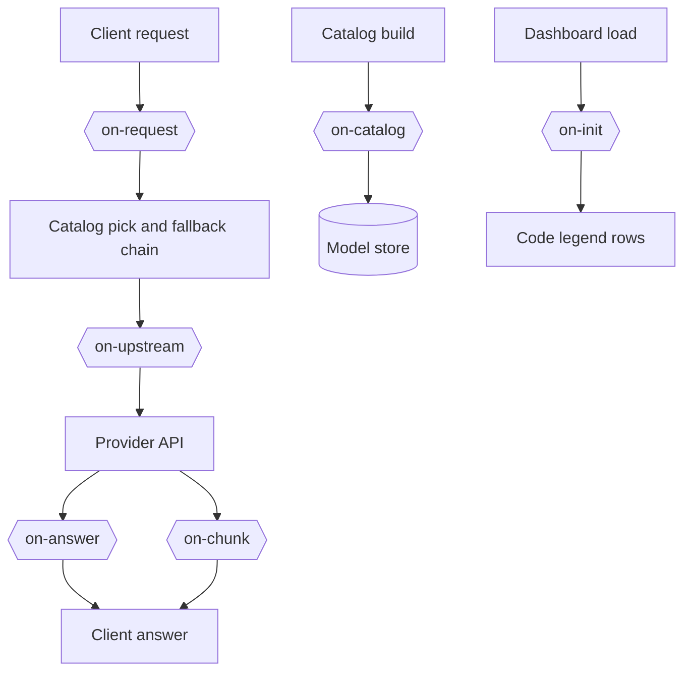

# Hooks

A hook is Python code that changes the catalog rows, chat requests and answers of a provider or a model. A `hooks` list names the hook files:

```yaml
openrouter:
  hooks:
    - on-upstream: hooks/openrouter_only.py
  models:
    z-ai/glm-5.3-flash:
      hooks:
        - on-catalog: hooks/cheapest_output.py
        - on-upstream: hooks/cheapest_output.py
```

The `hooks` key works like `order`. A `models` entry has priority. Then comes the provider block in the `{provider}.yml` file of the model, then the provider block in the main file. A model with `hooks: []` uses no hooks.

Each item has 1 hook point and 1 file path. The path starts in the `config` folder, and the file must stay in that folder. The file name can be any name.

## Hook points

For each point, the file defines 1 function with the name of the point.

| Point | Function | When | Gets |
| --- | --- | --- | --- |
| `on-request` | `on_request(value, model, headers)` | Before the chain of a chat request, and again on a repeat with the count | `value`: `key` (`None`), `digest`, the hash of the messages without the system rows, and on the second run `count`. `model`: the requested model. `headers`: the client headers. |
| `on-catalog` | `on_catalog(row, model, api_base, headers)` | At each catalog build, for each model with the hook, before the store write | `row`: a catalog row, the id cannot change. `api_base`, `headers`: for the provider API calls. |
| `on-upstream` | `on_upstream(body, model, headers)` | Before each chat request to the provider, streams and fallbacks included | `body`: the upstream JSON body, native format for native APIs. `model`: `provider/slug`. `headers`: changeable. |
| `on-answer` | `on_answer(answer, model)` | After a full chat answer comes back, before the client gets it | `answer`: the answer in the OpenAI format. A stream has no `on-answer` point. |
| `on-chunk` | `on_chunk(chunk, model, context)` | On each streamed chunk of a chat request, before the client gets it | `chunk`: 1 OpenAI chunk. `model`: the requested model. `context`: `previous` is the model of the last answer of the session. It is empty on the first answer. `attempts`: the failures so far. `code`: the retry code. `pool`: the landed pool. `served`: the landed model. |
| `on-init` | `on_init()` | At the dashboard load, for each enabled request hook file | No arguments. It returns the rows of the code legend of the dashboard, such as `[["rtN", "A repeat picked another model, N times"]]`. |



A request-level point, such as `on-request`, takes its file from the `request_hooks` group of `config/daedalus.yml`, because no provider owns the request yet:

```yaml
request_hooks:
  on-request: hooks/openwebui_retry.py
  on-chunk: hooks/pick.py
```

An empty value turns that point off. The `on-init` point has no group of its own: the dashboard reads the `on_init` function of each file in `request_hooks`. The legend card shows those rows below the base rows, and a file with no `on_init` adds no row. A file that sets `value["key"]` counts the requests of that key: a repeat after an answer is a try again.

`daedalus` then drops the models that answered the message: `daedalus/auto` steps the tier 1 step up, and a named pool keeps its pool. The point runs again with `count` filled in. A file that writes `value["code"]` sets the code of the Requests row, such as `rt1`. Without a `key`, a repeat is a new request.

Without a `code`, the row shows no code. `config/hooks/openwebui_retry.py` applies this rule to the `x-openwebui-chat-id` header of Open WebUI.
The media endpoints, transcription and images, count a repeat of the same content with no hook.
That count is the one repeat path of the base app.

A function gets a copy of the value. It can change the copy and return None, or it can return a new dict. The hooks of 1 point run in list order, and each hook gets the value of the hook before it.

## Errors

A hook error does not stop the request. daedalus logs the error, and the value goes on without the changes of that hook. The next hook in the list still runs. These are errors:

- An exception, or a return value that is not a dict or None
- A file that is not there, does not load, or has no function for the point
- A path outside the `config` folder, or an unknown point

## Changes

daedalus reads a file again when its file time changes. A restart is not necessary.

Hooks get no database access. An `on-catalog` hook changes only the row. daedalus writes only the known columns of the row, so a hook cannot change a table. A hook that keeps data uses its own file, such as `cheapest_output.json`.

The dashboard can edit the `hooks` list, but not the hook files. Only a person with access to the `config` folder can add a file. A hook runs inside the daedalus process, with all its access.

## Hook files in config

### `hooks/openwebui_retry.py`

A repeat of the same message in 1 Open WebUI chat is a try again.

| Item | Value |
| --- | --- |
| Runs | `on-request`, before the chain, and again on the repeat with the count |
| Writes | `value["key"]`, the chat id and the digest, and `value["code"]`, such as `rt1` |
| Named by | `request_hooks.on-request` in `config/daedalus.yml` |
| Legend | `on_init` returns the `rtN` row |

### `hooks/cheapest_output.py`

The endpoint list of a model goes from the cheapest output price to the most expensive one.

| Item | Value |
| --- | --- |
| Runs | `on-catalog` at each catalog build, and `on-upstream` before each provider call |
| Writes | The order in `.daedalus-state/cheapest_output.json`, then `provider.order` in the body |
| Named by | The `hooks` list of the model `z-ai/glm-5.3-flash` in `openrouter.yml` |
| Notes | A client `provider` object has priority. If the list read fails, the old order stays. |

The order holds provider slugs with no variant, such as `deepinfra` for `deepinfra/fp4`, and each provider keeps the place of its cheapest endpoint.

### `hooks/pick.py`

The model that served a chat pool request, in the final stream chunk, under `usage.daedalus`.

| Item | Value |
| --- | --- |
| Runs | `on-chunk`, on each streamed chunk of a `daedalus/auto` or pool request |
| Writes | `chunk["usage"]["daedalus"]` holds 3 keys. `line`: the served model for the client. `model`: the served slug. `pool`: the landed pool |
| Named by | `request_hooks.on-chunk` in `config/daedalus.yml`. The chat pools own no provider block, and the file itself passes every model that is not `daedalus/auto` or a chat pool |
| Shows | On the first answer of a session. When the served model differs from the last one. When the ladder moved. On the retry code of `openwebui_retry.py`. A reader of the key draws it: the Open WebUI filter `integrations/openwebui/pick_status.py` |

The line is `{tier} · {slug}` for `daedalus/auto`, such as `A · kilo/poolside/laguna-s-2.1:free`, and the slug alone for a named pool.

### `hooks/example.py`

A start for a new hook file: each function, with examples in the comments.

| Item | Value |
| --- | --- |
| Runs | Nowhere. No config names it. |
| Writes | Nothing. The examples stay in the comments. |
| Named by | A copy of the file under a new name, named in a `hooks` list or in `request_hooks` |

## Example

This hook tells OpenRouter to use only the endpoints in `provider.order`, and to use no other endpoint:

```python
def on_upstream(body, model, headers):
  if "order" in body.get("provider", {}):
    body["provider"]["allow_fallbacks"] = False
```

## New hook points

A model point is 1 item in `POINTS` in `daedalus/providers/hooks.py`, and 1 `hooks.run` call where the value is ready. A request point is also 1 key in the `request_hooks` group of the settings, and 1 `hooks.run_request` call.
