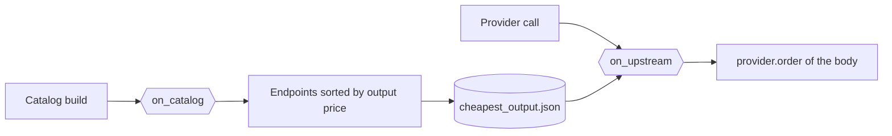

# The OpenRouter endpoint order

[`config/hooks/or_cheapest_output.py`](../../config/hooks/or_cheapest_output.py) orders the endpoints of a
model by output price, and writes that order into each request.

| Item | Value |
| --- | --- |
| Runs | `on-catalog` at each catalog build, and `on-upstream` before each provider call |
| Writes | The order in `.daedalus-state/cheapest_output.json`, then `provider.order` in the body |
| Named by | The `hooks` list of the model `z-ai/glm-5.3-flash` in [`openrouter.yml`](../../config/providers/openrouter.yml) |
| Notes | A client `provider` object has priority. If the list read fails, the old order stays. |

The order holds provider slugs with no variant, such as `deepinfra` for `deepinfra/fp4`.
Each provider keeps the place of its cheapest endpoint.

The other shipped hook files: [the auto reasoning effort and try-again rule](owui_auto_reasoning_effort.md) and [the served model line](served_model.md).
