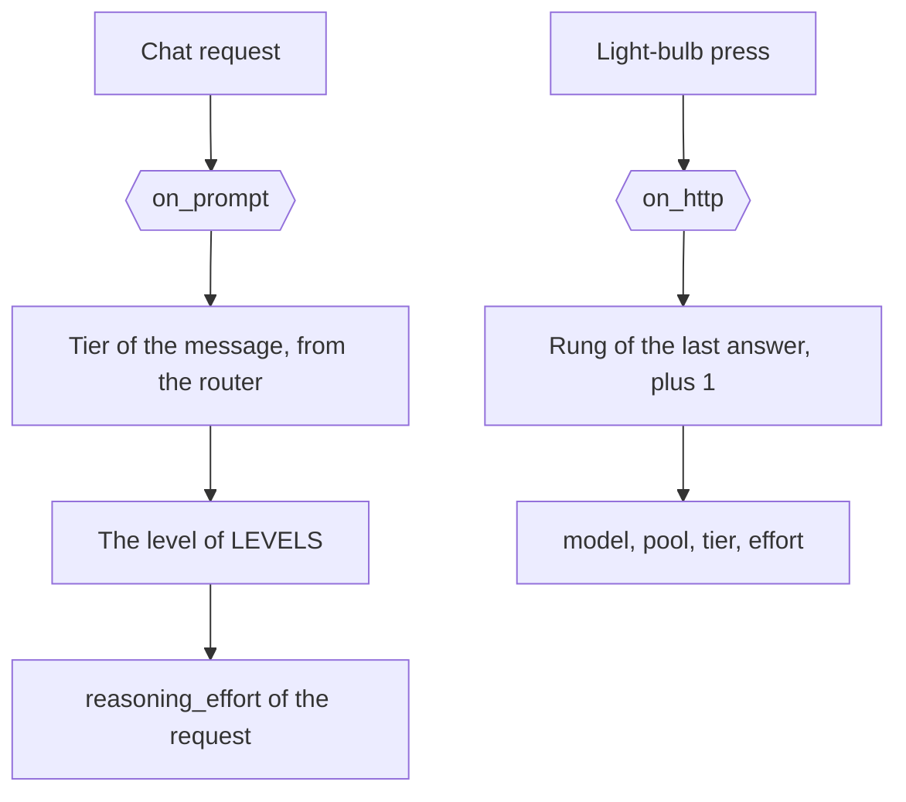

# The reasoning ladder

[`config/hooks/owui_auto_reasoning.py`](../../config/hooks/owui_auto_reasoning.py) holds both surfaces of the
reasoning ladder of 1 chat: the `on-prompt` point, and the `on-http` route.

| Item | Value |
| --- | --- |
| Runs | `on_prompt` before the first attempt of a chat request. `on_http` on `POST /v1/hook/owui_auto_reasoning` |
| Writes | `value["reasoning_effort"]`, from the tier of the message. The route answers the next rung |
| Named by | `request_hooks.on-prompt` in [`config/daedalus.yml`](../../config/daedalus.yml), and the light-bulb Action of Open WebUI |
| Serves | The Open WebUI client, from the `CLIENT` constant. The route serves any key |

## The level of a call

The `on-prompt` point sets `reasoning_effort` for the request. 3 levels decide, and the narrow one wins:

| Level | Value |
| --- | --- |
| The client | A `reasoning_effort` of the request body |
| A hook file | The value of `value["reasoning_effort"]` after the files of the point |
| The catalog | The stored effort of the model, from discovery or the provider file |

The base sets no effort of its own. With no hook file, a request keeps the client value and the catalog default.
The file reads the heuristics v2 tier of the message at hand, so each message of a chat gets its own level.
The `LEVELS` table holds the level of each tier, from `TIER-D` `none` to `TIER-A` `high`.
The point serves the client app of the `CLIENT` constant, so a Kilo request keeps its own effort.
A chain with no reasoning model gets no call and no effort.
`upstream.without_reasoning` drops the field for a model the catalog marks as no reasoner.

## The rung of the light-bulb

The route reads the last answer of the chat: its pool, or the tier of its `daedalus/auto` slot.
A chat with no answer reads the prompt. The answer holds the next rung, 1 step up, and the cap is `TIER-A`.
The answer holds `model`, `pool`, `tier`, `tier_name`, `reasoning_effort`, `before` and `top`.
`top` is true when the chat sits on `TIER-A` already.

The Action [`integrations/openwebui/actions/effort_bump.py`](../../integrations/openwebui/actions/effort_bump.py)
calls this route, answers the pressed turn again on the rung, and replaces the pressed text.
Open WebUI keeps the old text as `originalContent`. See the [bump action page](../integrations/owui/effort_bump.md).

The `on-http` surface of any hook file is in [Hooks](../hooks.md#the-http-surface).
