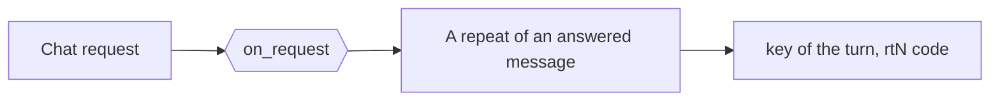
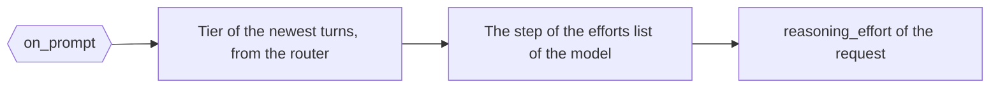

# Auto reasoning effort and try again

[`config/hooks/owui_auto_reasoning_effort.py`](../../config/hooks/owui_auto_reasoning_effort.py) holds 1
surface for each point: `on_request` names the turn and the code of a repeat, and `on_prompt` sets the
reasoning level of the request.

| Item | Value |
| --- | --- |
| Runs | `on_request` before the chain of a chat request. `on_prompt` before the first attempt |
| Writes | `value["key"]` and `value["code"]` on the repeat. `value["reasoning_effort"]` on the level |
| Named by | its own frontmatter block: `points: [on-request, on-prompt]`. The `hooks` keys of [`config/daedalus.yml`](../../config/daedalus.yml) run it first |
| Serves | The Open WebUI client, from the `CLIENT` constant, and the `x-openwebui-chat-id` header |

The first chart is the repeat key of `on_request`. The second is the level of `on_prompt`.

## The level of a call

The `on_prompt` point reads the heuristics v2 tier of the newest user turn and the newest model
turn, so each turn of a chat gets its own level. The model part keeps at most `ANSWER_CHARS`, 500
characters, because a long answer would bloat the read.

The tier indexes the `supported_reasoning_efforts` list of the model: `TIER-D` is step 0, the lowest
effort the model accepts, and each tier above is 1 step up. That key of the model or of its block
names the list first, then the list that the catalog holds for the model, and a provider with no
list keeps its coded default. The ladder stops at `high` and at the end of the list.

A value of the client keeps the last word over that read. The tier of the conversation stays with the
routing of `daedalus/auto`, so this file sets the level alone.

| Event | The level |
| --- | --- |
| A new message | The read of the newest user turn and model turn |
| A try again | 1 step above the level of the last answer, never below the value of the client |
| A try again after a model without reasoning | The read of the newest turns, with no step |
| Any request, at the top | `high` |

The base sets no effort of its own. The point serves the client of the `CLIENT` constant, so a Kilo
request or a generic client keeps its own effort. A chain with no reasoning model gets no call and
no effort. `upstream.without_reasoning` drops the field for a model the catalog marks as no reasoner.

## The try again

Open WebUI sends the header `x-openwebui-chat-id` when `ENABLE_FORWARD_USER_INFO_HEADERS` is true.
The `on_request` point names the turn from that header and the digest of the messages. A repeat of a
message that a model answered is a try again: daedalus steps 1 tier up for `daedalus/auto`, keeps a
named pool, and drops the models that answered. Then it calls the point again with `count` filled in,
and this file writes the code of the row, `rt1`, `rt2`.

The same count reaches `on_prompt` as `retry`, so the level of a try again follows the same press.
Without the header, a repeat is a new request. Without the file, a repeat of a message takes the
usual chain.

The other shipped hook files: [The served model line](served_model.md) and [the OpenRouter endpoint order](or_cheapest_output.md).
