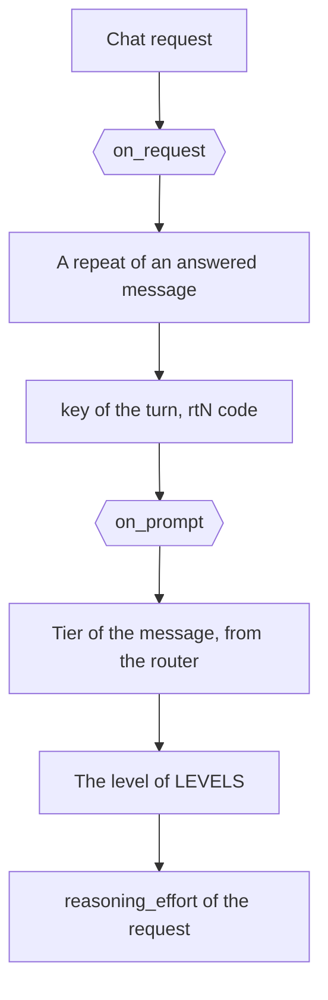

# Auto reasoning effort and try again

[`config/hooks/owui_auto_reasoning_effort.py`](../../config/hooks/owui_auto_reasoning_effort.py) holds 1
surface for each point: `on_request` names the turn and the code of a repeat, and `on_prompt` sets the
reasoning level of the request.

| Item | Value |
| --- | --- |
| Runs | `on_request` before the chain of a chat request. `on_prompt` before the first attempt |
| Writes | `value["key"]` and `value["code"]` on the repeat. `value["reasoning_effort"]` on the level |
| Named by | `request_hooks.on-request` and `request_hooks.on-prompt` in [`config/daedalus.yml`](../../config/daedalus.yml) |
| Serves | The Open WebUI client, from the `CLIENT` constant, and the `x-openwebui-chat-id` header |

## The level of a call

The `on_prompt` point reads the heuristics v2 tier of the message at hand, so each message of a chat
gets its own level. The `LEVELS` table holds the level of each tier, from `TIER-D` `none` to
`TIER-A` `high`. A value of the client keeps the last word over that read.

| Event | The level |
| --- | --- |
| A new message | The read of the message |
| A try again | 1 step above the level of the last answer, never below the value of the client |
| A try again after a model without reasoning | The read of the message, with no step |
| Any request, at the top | `high` |

The base sets no effort of its own. The point serves the client of the `CLIENT` constant, so a Kilo
request or a generic client keeps its own effort. A chain with no reasoning model gets no call and
no effort. `upstream.without_reasoning` drops the field for a model the catalog marks as no reasoner.

## The try again

Open WebUI sends the header `x-openwebui-chat-id` when `ENABLE_FORWARD_USER_INFO_HEADERS` is true.
The `on_request` point names the turn from that header and the digest of the messages. A repeat of a
message that a model answered is a try again: daedalus steps 1 tier up for `daedalus/auto`, keeps a
named pool, and drops the models that answered. Then it calls the point again with `count` filled in,
and this file writes the code of the row, `rt1`, `rt2`.

The same count reaches `on_prompt` as `retry`, so the level of a try again follows the same press.
Without the header, a repeat is a new request. Without the file, a repeat of a message takes the
usual chain.
