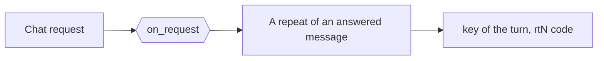
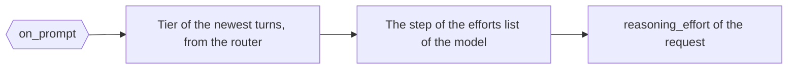

# Auto reasoning effort and try again

[`hooks/owui_auto_reasoning_effort.py`](../../hooks/owui_auto_reasoning_effort.py) holds 1
function for each surface: `on_request` names the turn and the retry code of a repeat, and `on_prompt` sets the
reasoning level of the request.

| Item | Value |
| --- | --- |
| Runs | `on_request` before the chain of a chat request. `on_prompt` before the first attempt. `on_chunk` on the final chunk |
| Writes | `value["key"]` and `value["code"]` on the repeat. `value["reasoning_effort"]` on the level. `usage.daedalus.line` on the chunk |
| Named by | its own frontmatter block: `surfaces: [on-request, on-prompt, on-chunk]`, `scope: client`, `targets: [OWUI]`. The `hooks` keys of [`config/daedalus.yml`](../../config/daedalus.yml) run it first |
| Serves | The Open WebUI client, from the `client` scope of its block, and the `x-openwebui-chat-id` header |

The first chart shows the repeat key of `on_request`. The second shows the level of `on_prompt`.

## The level of a call

The `on_prompt` surface reads the heuristics v2 tier of the newest user turn and of the newest
model turn. Each turn of a chat gets its own level. The model part keeps at most `ANSWER_CHARS`, 500
characters, because a long answer would make the read too large.

The tier indexes the `supported_reasoning_efforts` list of the model: `TIER-D` is step 0, the lowest effort the model accepts, and
each tier above is 1 step up. The key of the model, or of its block, wins first. Then the
list that the catalog holds for the model applies, and a provider with no list keeps its coded
default. The ladder stops at `high` and at the end of the list.

A value of the client keeps the last word over that read. The tier of the conversation stays with the
routing of `daedalus/auto`, so this file sets the level only.

| Event | The level |
| --- | --- |
| A new message | The read of the newest user turn and model turn |
| A try again | 1 step above the level of the last answer, never below the value of the client |
| A try again after a model without reasoning | The read of the newest turns, with no step |
| Any request, at the top | `high` |

The base sets no effort of its own, and the `client` scope of the block serves the Open WebUI
client. The base never runs this file for a Kilo request or a generic client, so that client keeps
its own effort. A chain with no reasoning model gets no call and no effort. `upstream.without_reasoning` drops the field for a model the catalog marks as a model with no reasoning.

## The served line

The [served model hook](served_model.md) writes the line of the final chunk first.
Then `on_chunk` of this file puts the routed effort at its end, such as `kilo/laguna-s-2.1:free · high`. An
effort of `none` leaves the line alone, and this file alone draws no line.

The files of a surface run in list order, and an installed file joins in name order. This name sorts
before `served_model.py`, so name the surface to make the override win:
`on-chunk: [hooks/served_model.py, hooks/owui_auto_reasoning_effort.py]`.

## The try again

Open WebUI sends `x-openwebui-chat-id` through the daedalus connection's custom headers. The bundled
deployment sets it to `{{CHAT_ID}}` without forwarding the user's personal fields.

The `on_request` surface names the turn from that header and the digest of the messages. A repeat of a
message that a model answered is a try again. daedalus steps 1 tier up for `daedalus/auto`, keeps a named
pool, and drops the models that answered. Then it calls the surface again with `count` filled in, and this
file writes the code of the request, `rt1`, `rt2`.

The same count reaches `on_prompt` as `retry`, so the level of a try again follows the same rule.
Without the header, a repeat is a new request. Without the file, a repeat of a message takes the
usual chain.

The other shipped hook files: [The served model line](served_model.md) and [the OpenRouter endpoint order](or_cheapest_output.md).
