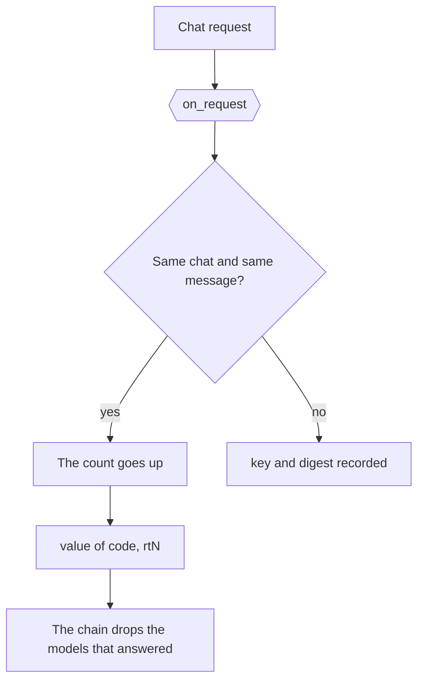

# The try-again rule

[`config/hooks/owui_retry.py`](../../config/hooks/owui_retry.py) reads a repeat of the same
message in 1 Open WebUI chat as a try again.

| Item | Value |
| --- | --- |
| Runs | `on-request`, before the chain, and again on the repeat with the count |
| Writes | `value["key"]`, the chat id and the digest, and `value["code"]`, such as `rt1` |
| Named by | `request_hooks.on-request` in [`config/daedalus.yml`](../../config/daedalus.yml) |
| Legend | `on_init` returns the `rtN` row |

`daedalus` then drops the models that answered the message: `daedalus/auto` steps the tier 1 step up,
and a named pool keeps its pool. The point runs again with `count` filled in.
A file that writes `value["code"]` sets the code of the Requests row, such as `rt1`.
Without a `key`, a repeat is a new request.
Without a `code`, the row shows no code.
The dashboard legend draws the `rtN` rows of `on_init`.
