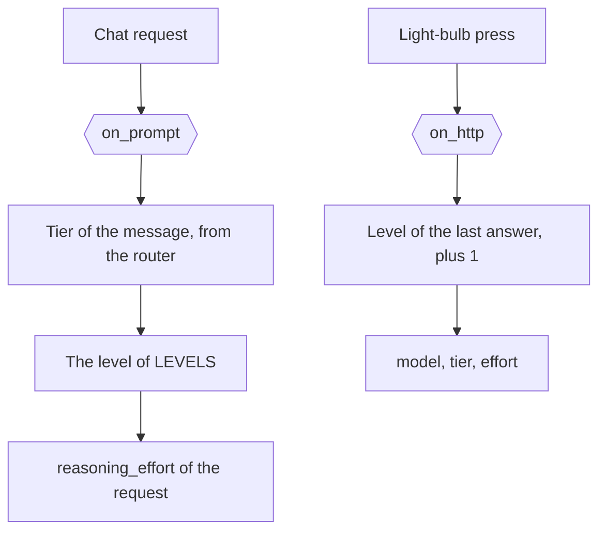

# Think longer

[`config/hooks/owui_think_longer.py`](../../config/hooks/owui_think_longer.py) holds both surfaces of the
think-longer ladder of 1 chat: the `on-prompt` point, and the `on-http` route.

| Item | Value |
| --- | --- |
| Runs | `on_prompt` before the first attempt of a chat request. `on_http` on `POST /v1/hook/owui_think_longer` |
| Writes | `value["reasoning_effort"]`, from the read of the message, a `think_longer` field, or a try again. The route answers the next level |
| Named by | `request_hooks.on-prompt` in [`config/daedalus.yml`](../../config/daedalus.yml), and the light-bulb Action of Open WebUI |
| Serves | The Open WebUI client, from the `CLIENT` constant. The field and the route serve any key |

## The level of a call

The `on-prompt` point sets `reasoning_effort` for the request. 4 values decide, and the narrow one wins:

| Level | Value |
| --- | --- |
| A `think_longer` field | That count of steps above the level of the last answer, never below the client value |
| A client `reasoning_effort` | The value of the request body |
| A try again | 1 step above the level of the last answer |
| The read of the prompt | The heuristics v2 tier of the message at hand |

The base sets no effort of its own. With no hook file, a request keeps the client value and the catalog
default. The point reads the heuristics v2 tier of the message at hand, so each message of a chat gets
its own level, and the `LEVELS` table holds the level of each tier, from `TIER-D` `none` to `TIER-A`
`high`. The point serves the client app of the `CLIENT` constant, so a Kilo request keeps its own effort.
The `think_longer` field of the body asks for its count of steps above the level of the last answer,
for any client, and that level wins over the value of the client. Without the field, the value of the
client wins over the read of the prompt. The try-again count of the message asks for 1 step.
A chain with no reasoning model gets no call and no effort.
`upstream.without_reasoning` drops the field for a model the catalog marks as no reasoner, and
`upstream.without_own` keeps `think_longer` out of the upstream body.

## The press of the light-bulb

The route reads the level of the last answer of the chat, which the base keeps for each session. A chat
with no answer reads its prompt. The answer holds the next level, 1 step up, and the cap is `high`.
The answer holds `model` (the model of the chat, so the level is the only lever), `reasoning_effort`,
`tier`, `tier_name`, `before` and `top`. `top` is true when the chat sits on `high` already.

The Action [`integrations/openwebui/functions/think_longer.py`](../../integrations/openwebui/functions/think_longer.py)
asks the same level through the chat route of Open WebUI, without a key of its own, and replaces the
pressed text. Open WebUI keeps the old text as `originalContent`. See the
[think longer action page](../integrations/owui/think_longer.md).

The `on-http` surface of any hook file is in [Hooks](../hooks.md#the-http-surface).
