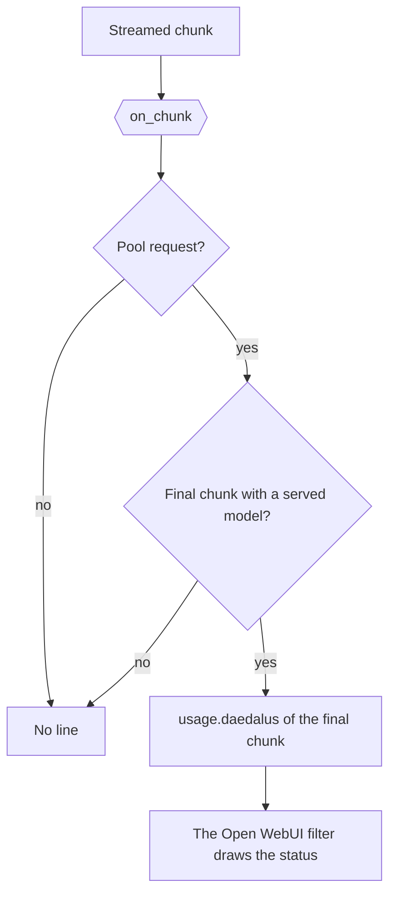

# The served model line

[`config/hooks/served_model.py`](../../config/hooks/served_model.py) reports the model that served a chat pool
request, in the final stream chunk, under `usage.daedalus`.

| Item | Value |
| --- | --- |
| Runs | `on-chunk`, on each streamed chunk of a `daedalus/auto` or pool request |
| Writes | `chunk["usage"]["daedalus"]` holds 3 keys. `line`: the served model for the client. `model`: the served slug. `pool`: the landed pool |
| Named by | `request_hooks.on-chunk` in [`config/daedalus.yml`](../../config/daedalus.yml), as `[hooks/served_model.py]` |
| Shows | On the final chunk of each `daedalus/auto` or pool answer, retries and repeats included. The [filter](../integrations/owui/served_model.md) draws 1 row for each line, and its `when` Valve picks the rows |

The line is `{tier} · {slug}` for `daedalus/auto`, such as `A · kilo/poolside/laguna-s-2.1:free`, and
the slug alone for a named pool. The [served model filter](../integrations/owui/served_model.md) draws it.
The chat pools own no provider block, so the `hooks` list of a provider cannot name this file.
The file itself skips every model that is not `daedalus/auto` or a chat pool.

The other shipped hook files: [the auto reasoning effort and try-again rule](owui_auto_reasoning_effort.md) and [the OpenRouter endpoint order](or_cheapest_output.md).
