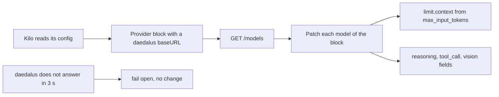

# Kilo Code integration

[`integrations/kilo/daedalus.js`](../../integrations/kilo/daedalus.js) is a Kilo Code plugin. It
copies the daedalus token limits and the feature flags of each model into the Kilo config in memory.
Kilo reads limits only from its config, and the plugin starts on each config change.

| Item | Value |
| --- | --- |
| Runs | In Kilo, on the server hook `config`, for each provider block |
| Reads | `GET {baseURL}/models` of daedalus, and the key of the block, the Kilo auth store, then `DAEDALUS_API_KEY` |
| Writes | The fields of the model in the Kilo config in memory. The config file does not change |
| Fails | Open: a late or a failed read logs 1 line, and the Kilo config keeps its own values |



| Kilo model field | Value |
| --- | --- |
| `limit.context` | `max_input_tokens` |
| `limit.output` | `0`: Kilo uses its default |
| `tool_call` | `supports_function_calling` |
| `reasoning` | `supports_reasoning` |
| `modalities.input`, `attachment` | `["text", "image"]` and `true`, when `supports_vision` is `true` |

The plugin changes each provider that has the id `daedalus` or a `daedalus/` model. It uses the
`baseURL` of the provider. The key comes from the first of these:

1. `options.apiKey` of the provider
2. The Kilo auth store: the key from the custom provider dialog
3. The `DAEDALUS_API_KEY` variable

## Install

Copy the file into the Kilo plugin folder, then restart Kilo.

cmd:

```cmd
mkdir "%USERPROFILE%\.config\kilo\plugin"
copy integrations\kilo\daedalus.js "%USERPROFILE%\.config\kilo\plugin\"
```

PowerShell:

```powershell
New-Item -ItemType Directory -Force "$HOME\.config\kilo\plugin"
Copy-Item integrations\kilo\daedalus.js "$HOME\.config\kilo\plugin\"
```

bash:

```bash
mkdir -p ~/.config/kilo/plugin
cp integrations/kilo/daedalus.js ~/.config/kilo/plugin/
```

Kilo shows no routed model for a custom provider. The **Requests** page and the log show it.
