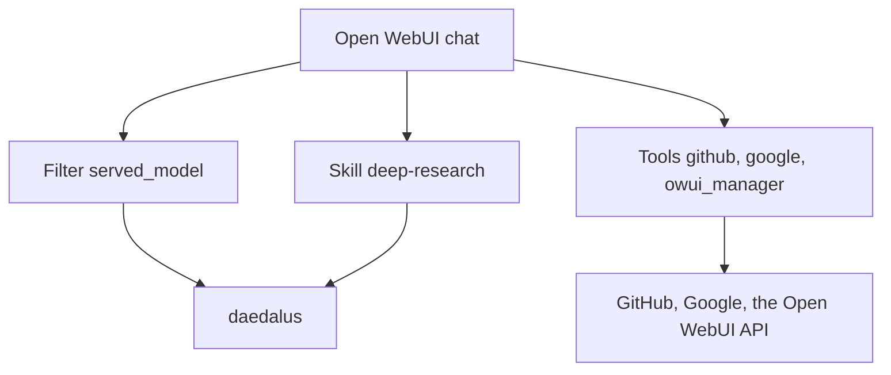

# Open WebUI integration

The [`integrations/openwebui`](../../integrations/openwebui) folder holds 1 directory for each Open WebUI plugin type. [`functions/`](../../integrations/openwebui/functions) holds the filters and the pipes. [`tools/`](../../integrations/openwebui/tools) holds the Workspace Tools. [`skills/`](../../integrations/openwebui/skills) holds the skills.

Each file is 1 plugin: paste its content in **Workspace → Tools** or **Workspace → Skills**, or import the file. The sections below name the install steps and the valves of each plugin.

| Plugin | Type | What it does |
| --- | --- | --- |
| [`deep-research.md`](owui/deep-research.md) | Skill | A research plan over `search_web` and `fetch_url` |
| [`served_model.py`](owui/served_model.md) | Filter | Draws the daedalus served model line above the answer |
| [`github.py`](owui/github.md) | Tool | The GitHub reads and writes, behind the permission gate |
| [`google.py`](owui/google.md) | Tool | Gmail, Calendar, Drive and Docs, behind the permission gate |
| [`owui_manager.py`](owui/owui_manager.md) | Tool | The workspace: knowledge, skills, files, tools and functions |

## Install

1. **Admin Panel → Functions**, **New Function**, type **Filter** or **Action**, paste the file, **Save**. A Tool or a Skill uses **Workspace → Tools** or **Workspace → Skills**, with **Create** or **Import JSON**.
2. **Access** on the item: make it public, or give read access to each user. A user without read access does not see the plugin.
3. **Valves**: set the keys of the plugin. The page of each plugin names them.
4. **Workspace → Models**: turn the plugin on for a model. A tool id and an action id ride in the `meta.toolIds` and `meta.actionIds` lists of the model.
5. **The daedalus key**: the tools carry the keys of their services. The filter reads the stream, so it holds no daedalus key.

A gated tool asks over the socket of the chat tab. `WEBSOCKET_EVENT_CALLER_TIMEOUT` is unset by
default, so the Open WebUI server waits without a timeout when the browser does not answer. Only
`timeout_seconds` ends that wait. A page refresh drops the dialog, the tool returns `denied: true`,
and it sends nothing.
