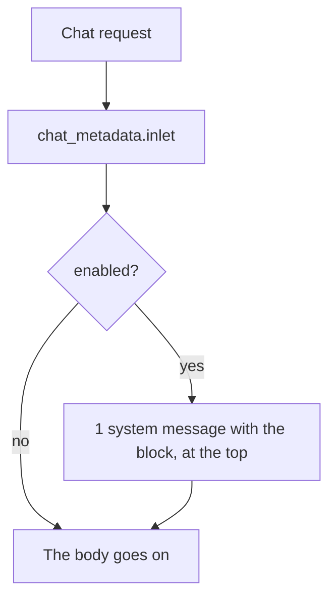

# The chat metadata filter

[`integrations/openwebui/functions/chat_metadata.py`](../../../integrations/openwebui/functions/chat_metadata.py)
is an Open WebUI Filter: it puts 1 system message at the top of the chat. That message carries the
date with the clock, the timezone, the place and the language.

| Item | Value |
| --- | --- |
| Type | Filter. The `inlet` method reads the body |
| Reads | The clock of the server, and the `Accept-Language` header of the request |
| Valves | `enabled`, default `true`. `location`, empty by default. `location_approximate`, `false` by default. `language`, empty by default |
| Install | **Admin Panel → Functions**, **New Function**, type **Filter**, paste, **Save** |

The Filter starts nothing and needs no key. It draws the block on each turn, so the date and the
clock stay fresh. The block holds 4 lines at most:

| Line | Value |
| --- | --- |
| `Current date/time` | The ISO 8601 stamp with the offset of the server |
| `Timezone` | The name of the zone, for example `PST` |
| `Location` or `Approximate location` | The place of the `location` Valve |
| `Language` | The language of the `language` Valve, else of the request header |

The place line reads `Approximate location` while the `location_approximate` Valve is on, which suits an IP
lookup. It reads `Location` for a precise place. The `language` Valve wins over the request. An empty Valve
reads the first value of the `Accept-Language` header of the request.

With no Valve and no header, the line reads `unknown`.

A repeat replaces the block of the Filter, so the messages keep 1 of them, at the top. With the
`enabled` Valve off, the body returns as it came in.

See [Open WebUI integration](../owui.md) for the other plugins.
