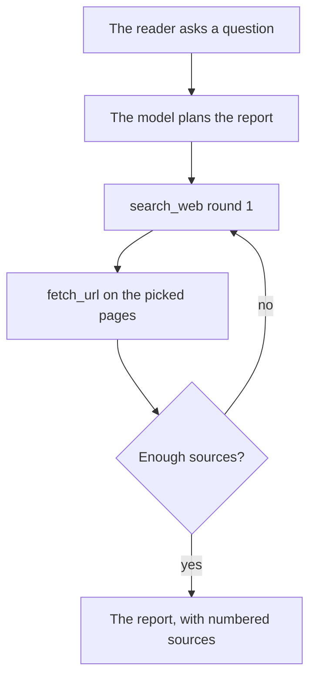

# Deep research skill

[Open WebUI integration](../owui.md)

[`integrations/openwebui/skills/deep-research.md`](../../../integrations/openwebui/skills/deep-research.md) is an Open WebUI skill: plain instructions, no code. The model plans, searches in 3 to 5 rounds with `search_web`, reads pages with `fetch_url`, and writes a report with numbered sources. Each step is a normal chat request, so daedalus failover and loop checks apply.

1. **Workspace → Skills**, the arrow next to **Create**, **Import JSON**. Select `deep-research.md`, then **Save**.
2. **Access** on the skill: make it public, or give read access to each user. A user without read access does not receive the skill.
3. **Workspace → Models**, **Create**: base model `daedalus/sophos`, name `Deep Research`. In **Skills**, select `deep-research`. **Save**.
4. In a chat with `Deep Research`, keep **Web Search** on. Use `$deep-research` in a chat with another model.
