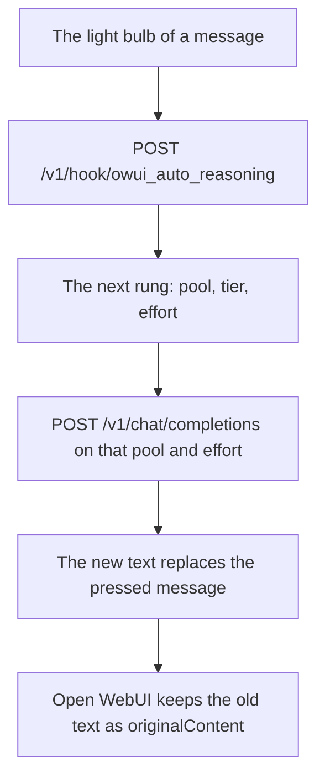

# Reasoning bump action

[Open WebUI integration](../owui.md)

[`integrations/openwebui/actions/effort_bump.py`](../../../integrations/openwebui/actions/effort_bump.py) is an Open WebUI Action: 1 file, the light bulb of the message toolbar. 1 press moves the chat 1 rung up the reasoning ladder of daedalus, and answers the pressed turn again on that rung.

1. Put [`config/hooks/owui_auto_reasoning.py`](../../../config/hooks/owui_auto_reasoning.py) in the `config/hooks` folder of daedalus. The action calls the file by name, so a press without it answers 404.
2. **Admin Panel → Functions**, the **+** menu, **New Function**, type **Action**, paste the file, **Save**.
3. **Workspace → Models**, the model, the **Actions** selector: turn the action on. The id rides in the `meta.actionIds` list of the model, so only those models draw the button.
4. **Valves**: set `DAEDALUS_API_KEY`. Set `DAEDALUS_API_BASE` when daedalus does not sit on `http://127.0.0.1:3357`.

| Valve | Default | Meaning |
| --- | --- | --- |
| `DAEDALUS_API_BASE` | `http://127.0.0.1:3357` | The daedalus base URL |
| `DAEDALUS_API_KEY` | empty | The key of the daedalus chat, as a password field |
| `timeout_seconds` | `300` | The wait for 1 press, the new answer included |
| `SHOW_STATUS` | `true` | Draw the status line of the press |

1 press runs 2 steps. The action posts the chat to `/v1/hook/owui_auto_reasoning`, which names the pool, the tier and the effort of the next rung. It then posts the turn to `/v1/chat/completions` with that pool and that effort, and returns the new text. Open WebUI keeps the old text as `originalContent` of the message, so the reader steps back with the arrows of the chat.

The same file holds the `on-prompt` point, which sets the reasoning level of each request from the heuristics v2 read. That point serves the `CLIENT` constant of the file, `OWUI` by default, so Kilo and a generic client keep their own effort.

[`tests/integrations/test_owui_effort_bump.py`](../../../tests/integrations/test_owui_effort_bump.py) holds the 2 steps, the error paths and the returned message.
