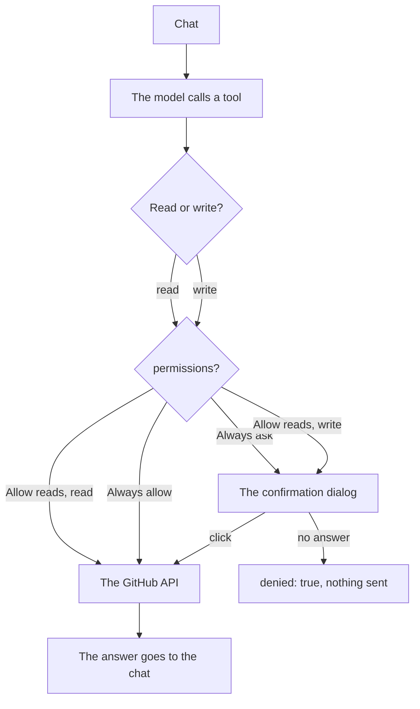

# GitHub tool

[Open WebUI integration](../owui.md)

[`integrations/openwebui/tools/github.py`](../../../integrations/openwebui/tools/github.py) is an Open WebUI Workspace Tool: one Python file, standard library only, empty `requirements`. It holds the GitHub surface of the reference connector. The `permissions` valve sets the gate. `Always ask`, the shipped default, holds every call, reads included. `Allow reads` frees the reads and holds the writes.

3 tools sit outside the connector list. `create_pr_with_files` writes a file list as 1 commit and opens or updates the pull request. `list_commits` reads the history of a path or a branch. `list_tree` reads the whole tree in 1 call.

3 security reads cover the alert lists: `code_scanning_alerts`, `secret_scanning_alerts` and `dependabot_alerts`. Each lists with filters, or reads 1 alert with its instances or locations. They need a token with the `security_events` scope, or the matching fine-grained read. Without it GitHub answers 403.

2 CI reads cover the checks. `check_runs` lists the check runs of a ref with the name, the status and the filter, or reads 1 run with its annotations. `list_workflows` lists the Actions workflows.

4 more reads ship:

| Read | Use |
| --- | --- |
| `actions_minutes` | The Actions minutes of an org or a user |
| `releases` | The releases, or 1 by id or tag |
| `tags` | The tags |
| `packages` | The packages of the signed-in user, a user or an org |

Gist management ships as 5 tools: `gists`, `fetch_gist`, and the gated writes `create_gist`, `update_gist` and `delete_gist`.

The 3 alert reads take gated writes: `update_code_scanning_alert`, `update_secret_scanning_alert` and `update_dependabot_alert` dismiss, resolve or reopen an alert.

1. **Workspace → Tools**, **Create**, paste the file, **Save**.
2. **Valves**: set `github_token`, or set the `GITHUB_TOKEN` environment value. Set `permissions`. `Always ask` is the shipped default.
3. **Access** on the tool: make it public, or give read access to each user. A user without read access does not see the tool.

| Valve | Default | Meaning |
| --- | --- | --- |
| `github_token` | empty | The token. `GITHUB_TOKEN` is the fallback. |
| `permissions` | `Always ask` | `Always ask` gates every call, reads included. `Allow reads` frees the reads and holds the gated calls. `Always allow` holds nothing. |
| `timeout_seconds` | `60` | The wait for the confirmation. A closed tab, no dialog, or a late answer reads as no. |
| `http_timeout_seconds` | `30` | The GitHub HTTP timeout. |
| `api_version` | `2022-11-28` | The `X-GitHub-Api-Version` header. |
| `max_files_per_commit` | `30` | The file limit of `create_pr_with_files`. |
| `max_tree_entries` | `2000` | The entry limit of `list_tree`. |

The 22 reads are the issue, pull request, commit, workflow and profile reads. Under `Always ask` each one waits for the click, so no repository line reaches the chat. `Allow reads` frees them.

`UserValves.mode` gives each user the same 3 levels, and `default` follows the tool valve. `UserValves.timeout_seconds` gives each user their own confirmation wait. A value of `0` keeps the valve.

The confirmation travels over the socket of the chat tab. `WEBSOCKET_EVENT_CALLER_TIMEOUT` is unset by default, so the Open WebUI server waits without a timeout when the browser does not answer. Only `timeout_seconds` ends that wait. A page refresh drops the dialog, the tool returns `denied: true`, and it sends nothing.

[`tests/integrations/test_owui_github_tool.py`](../../../tests/integrations/test_owui_github_tool.py) holds the tool surface, the gate and the error path.
