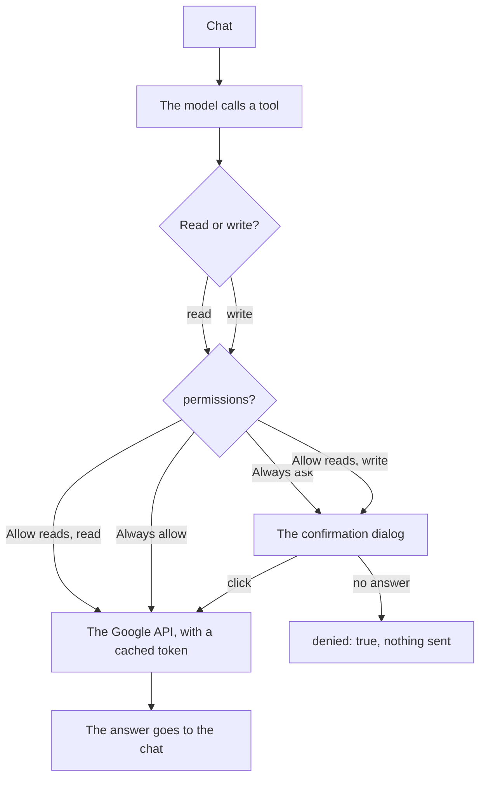

# Google tool

[Open WebUI integration](../owui.md)

[`integrations/openwebui/tools/google.py`](../../../integrations/openwebui/tools/google.py) is a second Workspace Tool: 1 file, standard library only, empty `requirements`. It holds Gmail, Calendar, Drive and Docs. The `permissions` valve sets the gate. `Always ask`, the shipped default, holds every call, reads included. `Allow reads` frees the reads and holds the writes.

1. In the Google Cloud console, make an OAuth client of the type Desktop app, and turn on the Gmail, Calendar, Drive and Docs APIs.
2. Do the consent 1 time, with the scopes `gmail.readonly`, `gmail.send`, `calendar.readonly`, `calendar.events`, `drive.readonly` and `documents`. The reply holds the refresh token.
3. **Valves**: set `google_client_id`, `google_client_secret` and `google_refresh_token`. Set `permissions`. `Always ask` is the shipped default.

| Valve | Default | Meaning |
| --- | --- | --- |
| `google_client_id` | empty | The OAuth client id. |
| `google_client_secret` | empty | The OAuth client secret. |
| `google_refresh_token` | empty | The refresh token of the 1-time consent. The tool trades it for an access token and caches that for an hour. |
| `calendar_id` | `primary` | The calendar the agenda reads. |
| `max_results` | `10` | The default page of a list read. |
| `permissions` | `Always ask` | `Always ask` gates every call, reads included. `Allow reads` frees the reads and holds the gated calls. `Always allow` holds nothing. |
| `timeout_seconds` | `60` | The wait for the confirmation. A closed tab, no dialog, or a late answer reads as no. |
| `http_timeout_seconds` | `30` | The Google HTTP timeout. |

The 5 reads are `search_mail`, `read_thread`, `agenda`, `search_files` and `read_document`. The 3 gated writes are `send_mail`, `create_event` and `append_to_document`.

The shipped `Always ask` holds every call, reads included, so no mail line and no one time code reaches the chat without a click. `Allow reads` frees the reads and keeps the gate on the 3 writes. `Always allow` runs everything. `UserValves.mode` carries the same 3 values for one user, and `default` follows the tool valve.

[`tests/integrations/test_owui_google_tool.py`](../../../tests/integrations/test_owui_google_tool.py) holds the surface, the gate, the token cache and the error path.
