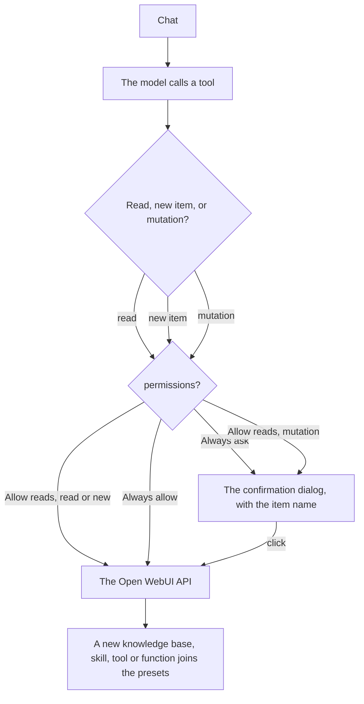

# The manager tool

[Open WebUI integration](../owui.md)

[`integrations/openwebui/tools/owui_manager.py`](../../../integrations/openwebui/tools/owui_manager.py) is 1 Workspace Tool over the whole workspace: knowledge bases, skills, the file library, the Workspace Tools and the Functions. The caller token comes from the chat request, and the `OWUI_API_BASE` valve holds the base URL.

| Group | Tools |
| --- | --- |
| Knowledge | The 23 knowledge tools: bases, folders, files, search, tree. A file creation waits for the indexing |
| Files | `list_files`, `search_files`, `upload_file`, `rename_file`, `read_file_content`, `delete_file` |
| Skills | `list_skills`, `show_skill`, `install_skill`, `create_skill`, `update_skill`, `toggle_skill`, `delete_skill` |
| Tools | `list_tools`, `show_tool`, `create_tool`, `update_tool`, `toggle_tool`, `delete_tool` |
| Functions | `list_functions`, `show_function`, `create_function`, `update_function`, `toggle_function`, `delete_function` |

The `permissions` valve holds 3 levels. `Always ask` gates every call, reads included. `Allow reads` frees the reads and the new items, and holds the mutations and the toggles. `Always allow` holds nothing. The item name rides in the question.

A new knowledge base, skill, tool or function joins the model presets in the same call. The tool reads each preset, merges the matching `meta` list and posts the record back. It skips a preset without write access and names it. The `PRESET_MODELS` valve picks the presets by id or by name, and an empty list serves each preset.

`timeout_seconds` sets the wait for the confirmation, and `UserValves.mode` plus `UserValves.timeout_seconds` give each user their own gate, where `0` keeps the valve. Open WebUI v0.11.4 has no per-tool toggle route, so `toggle_tool` toggles the tool id in the preset `toolIds` lists.

The preset helpers stay private, so Open WebUI builds no model tool spec for them. `/model/update` needs the owner, a write grant or an admin.

| Valve | Default | Meaning |
| --- | --- | --- |
| `OWUI_API_BASE` | `http://127.0.0.1:8080/api/v1` | The Open WebUI API base |
| `PRESET_MODELS` | empty | The ids or names of the presets that take an attach. Empty serves each preset |
| `permissions` | `Always ask` | `Always ask` gates every call, reads included. `Allow reads` frees the reads and the new items. `Always allow` holds nothing |
| `timeout_seconds` | `60` | The wait for a confirmation. `0` keeps the valve |
| `INSTALL_FETCH_TIMEOUT` | `12.0` | The URL fetch timeout of a skill install |
| `TRUSTED_DOMAINS` | `github.com,huggingface.co,githubusercontent.com` | The domains a skill install may fetch from |
| `SHOW_STATUS` | `true` | Draw the status line of each operation |

1. **Workspace → Tools**, **Create**, paste the file, **Save**.
2. **Access** on the tool: make it public, or give read access to each user.

[`tests/integrations/test_owui_manager.py`](../../../tests/integrations/test_owui_manager.py) holds the surface, the gate, the free reads and creates, the preset filter, the attach and the merge.
