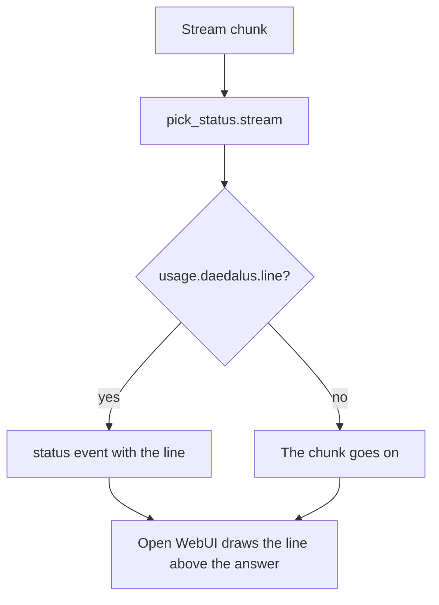

# The pick filter

[`integrations/openwebui/functions/pick_status.py`](../../../integrations/openwebui/functions/pick_status.py)
is an Open WebUI Filter: it draws the daedalus pick line above the answer body.

| Item | Value |
| --- | --- |
| Type | Filter. The `stream` method reads each chunk |
| Reads | `usage.daedalus.line` of the chunk, which [`hooks/model_served.py`](../../hooks/model_served.md) writes |
| Valves | `enabled`, default `true`. `prefix`, empty by default |
| Install | **Admin Panel → Functions**, **New Function**, type **Filter**, paste, **Save** |

The Filter starts nothing and needs no key. Without a pick in the stream, it draws no line. The
`enabled` Valve silences the line without an uninstall, and `prefix` puts own text before it.
Open WebUI draws the newest entry of the status list a second time while the reader has the list
open. That row is the header row of the list, so no line is lost.
