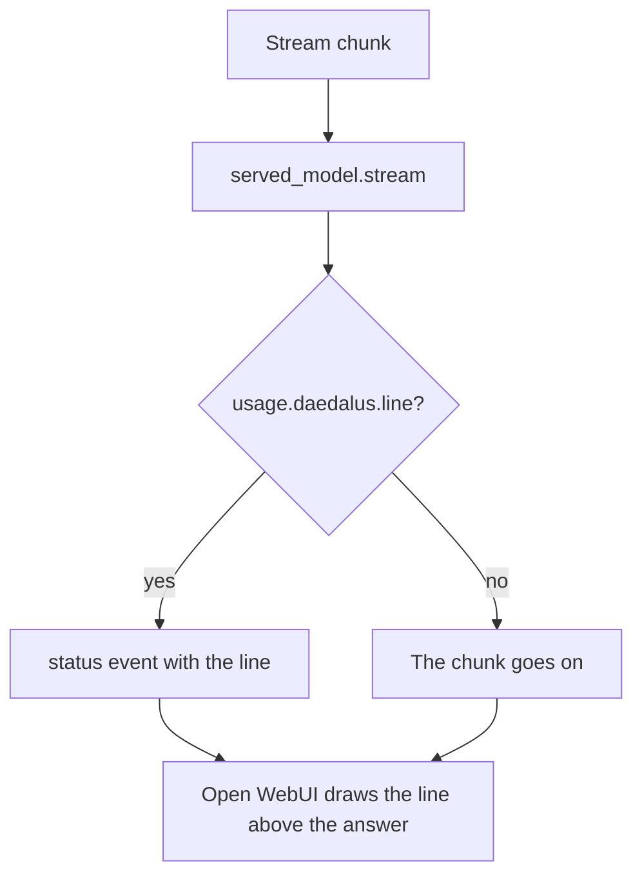

# The served model filter

[`integrations/openwebui/functions/served_model.py`](../../../integrations/openwebui/functions/served_model.py)
is an Open WebUI Filter: it draws the daedalus served model line above the answer body.

| Item | Value |
| --- | --- |
| Type | Filter. The `stream` method reads each chunk |
| Reads | `usage.daedalus.line` of the chunk, which [`hooks/served_model.py`](../../hooks/served_model.md) writes |
| Valves | `enabled`, default `true`. `prefix`, empty by default. `when`, `always` by default, else `on change` |
| Install | **Admin Panel → Functions**, **New Function**, type **Filter**, paste, **Save** |

The Filter starts nothing and needs no key. Without a served model in the stream, it draws no line. The
`enabled` Valve silences the line without an uninstall, and `prefix` puts own text before it. The
`when` Valve sets the moment: `always` draws each line that arrives, and `on change` draws a line
only when the served model of the chat moves. The Filter keeps the last served model of each chat
for that valve.
Open WebUI draws the newest entry of the status list a second time while the reader has the list
open. That row is the header row of the list, so no line is lost.

See [Open WebUI integration](../owui.md) for the other plugins.
