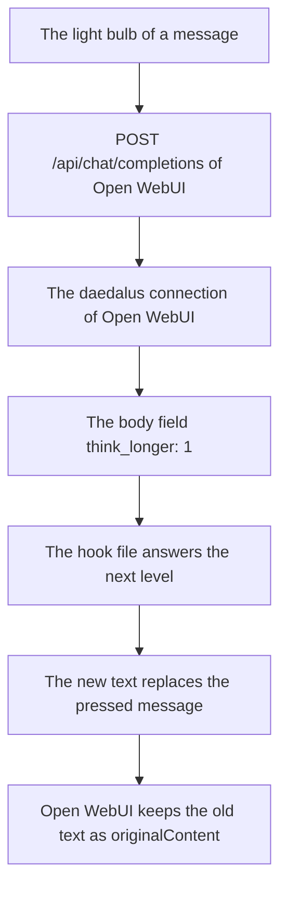

# Think longer action

[Open WebUI integration](../owui.md)

[`integrations/openwebui/actions/think_longer.py`](../../../integrations/openwebui/actions/think_longer.py)
is an Open WebUI Action: 1 file, the light bulb of the message toolbar. 1 press asks daedalus to think
longer on the pressed turn, 1 reasoning level step up, and answers that turn again at that level.
The action holds no daedalus key: it asks Open WebUI with the caller session, and the daedalus
connection of Open WebUI carries the call.

1. Put [`config/hooks/owui_think_longer.py`](../../../config/hooks/owui_think_longer.py) in the `config/hooks` folder of daedalus. The file reads the `think_longer` field of the body, so a daedalus without it answers at the usual level.
2. **Admin Panel → Functions**, the **+** menu, **New Function**, type **Action**, paste the file, **Save**.
3. **Workspace → Models**, the model, the **Actions** selector: turn the action on. The id rides in the `meta.actionIds` list of the model, so only those models draw the button.
4. **Valves**: no key. The action posts to Open WebUI itself, and Open WebUI holds the daedalus key in its connection.

| Valve | Default | Meaning |
| --- | --- | --- |
| `timeout_seconds` | `300` | The wait for 1 press, the new answer included |
| `SHOW_STATUS` | `true` | Draw the status line of the press |

1 press runs 1 step. The action posts the pressed turn to `/api/chat/completions` of Open WebUI with
the caller session, and the body carries `think_longer: 1`. Open WebUI sends the call through the
daedalus connection it already holds, and the hook file `config/hooks/owui_think_longer.py` sets the
level of the request: the level of the last answer, plus 1. The action names the model of the chat, so
the level is the only lever, and the try-again chain of daedalus stays out of the press. The new text
replaces the pressed message, and Open WebUI keeps the old text as `originalContent` of the message, so
the reader steps back with the arrows of the chat.

The same file holds the `on-prompt` point, which sets the reasoning level of each request. See the
[hook page](../../hooks/owui_think_longer.md).

[`tests/integrations/test_owui_think_longer.py`](../../../tests/integrations/test_owui_think_longer.py)
holds the call, the error paths and the returned message.
