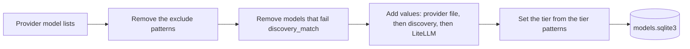

# Providers

> Q: Why these 7 providers? For example: free tiers, speed, or model choice.

| Provider key | Provider | API | Notes |
| --- | --- | --- | --- |
| `cloudflare` | Cloudflare Workers AI | OpenAI-compatible, plus the native run API for audio and images | Text content only. Paid models stay out of the catalog. |
| `gemini` | Google Gemini | Native Gemini API | Daedalus maps OpenAI requests to Gemini and back, with thought signatures. |
| `groq` | Groq | OpenAI-compatible | Gets only the message fields that it accepts. |
| `kilo` | Kilo Gateway | OpenAI-compatible | |
| `mistral` | Mistral | OpenAI-compatible | Gets only the message fields that it accepts. |
| `openrouter` | OpenRouter | OpenAI-compatible | |
| `z-ai` | Z.ai | OpenAI-compatible | |

> Q: Which provider do you trust most, and why?

## Catalog

`daedalus catalog` makes the model store in `.daedalus-state/models.sqlite3`.

| Rule | Value |
| --- | --- |
| Schedule | Each 6 h from 06:00 in `TZ`. `catalog.every: 0` stops it. |
| Provider error | Daedalus keeps the old rows of that provider only. |
| Chat chains | Only chat rows, and rows with no mode, go into the chains. |

## Endpoints for models that do not chat

| Provider | Embeddings | Transcriptions | Speech | Images |
| --- | --- | --- | --- | --- |
| Cloudflare | Yes | Whisper, native API | MeloTTS and Aura, native API | Flux and SDXL-type models, native API |
| Gemini | Yes, native API | 400 | 400 | 400 |
| Groq | - | Yes | Yes | - |
| Mistral | Yes | `language` and `temperature` only | - | - |

- "Yes": the provider has free models for this endpoint.
- "-": we know of no free model. Daedalus sends the request to the OpenAI-compatible API of the provider.
- "400": Daedalus stops the request.

Limits of the native Cloudflare API:

| Endpoint | Limit |
| --- | --- |
| Transcriptions | `response_format` is `json`, `text` or `vtt` |
| Speech | MeloTTS answers in MP3 only |
| Images | 1 image for each request. Flux 1 ignores `size`. |

> Q: Which of these endpoints do you use, and with which client?
