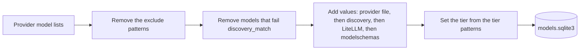

# Providers

Each provider except Pollinations has a tested free tier.

| Provider key | Provider | API | Notes |
| --- | --- | --- | --- |
| `cloudflare` | Cloudflare Workers AI | OpenAI-compatible, plus the native run API for audio and images | A text-only message goes as 1 string. Paid models stay out. Order 2. The Clef models carry the `decisions` mode, not `chat`. |
| `gemini` | Google Gemini | Native Gemini API | daedalus maps OpenAI to Gemini and back, thought signatures included. [`free.yml`](../config/providers/free.yml) sets `reasoning_effort: high`. |
| `groq` | Groq | OpenAI-compatible | daedalus sends only the message fields that Groq accepts. |
| `kilo` | Kilo Gateway | OpenAI-compatible | Only `:free` models, and `stealth/` models with price 0 in each price field. |
| `mistral` | Mistral | OpenAI-compatible | Only the message fields that it accepts. `reasoning_effort`: `none` or `high`. Thinking chunks are `reasoning_content`. |
| `openrouter` | OpenRouter | OpenAI-compatible, plus the OpenRouter Image API (`/images`). Speech is mp3, or pcm on ask. | Only `:free` and price-0 `stealth/` models. Output types set the modes. Images need credits. |
| `pollinations` | Pollinations | OpenAI-compatible | In [`pollinations.yml`](../config/providers/pollinations.yml), not [`free.yml`](../config/providers/free.yml): its Pollen does not refill ([pollinations#11580](https://github.com/pollinations/pollinations/issues/11580)). Order 2, as Cloudflare. |
| `z-ai` | Z.ai | OpenAI-compatible | Only the 3 free models under `models:`: `glm-4.5-flash`, `glm-4.7-flash` and `glm-4.6v-flash`. |

| Provider | How daedalus keeps it free |
| --- | --- |
| Cloudflare, Gemini, Groq, Mistral | Use an account on the free plan, with no payment method. |
| Kilo, OpenRouter | The `!*:free` exclude pattern. Lyria models show price 0 and cost money for each song. |
| Pollinations | Not free ([pollinations#11580](https://github.com/pollinations/pollinations/issues/11580)). The `"*"` exclude pattern, only the 4 image models under `models:`. |
| Z.ai | The `"*"` exclude pattern, and only the free models under `models:`. |

The Pollen balance does not refill with time. Since 22 June 2026, each tier gives a one-time Pollen bonus in place of an hourly refill ([pollinations#11580](https://github.com/pollinations/pollinations/issues/11580)). `GET https://gen.pollinations.ai/account/balance` shows the balance. At 0 Pollen, the Pollinations models fail and get a cooldown, and the image pool uses Cloudflare.

The image pool uses `lykon/dreamshaper-8-lcm`, `black-forest-labs/flux.1-schnell`, `tongyi-mai/z-image-turbo` and `black-forest-labs/flux.2-klein-4b`, at 0.0001 to 0.005 Pollen for each image.

## Contents

- [Get a key](#get-a-key)
- [Catalog](#catalog)
- [Endpoints for non-chat models](#endpoints-for-non-chat-models)

## Get a key

The 8 providers each need a key: Cloudflare, Gemini, Groq, Kilo, Mistral, OpenRouter, Pollinations and Z.ai. See [Provider keys](provider-keys.md) for the steps of each one.

### Use the key

1. Open the **Providers** page of the dashboard.
2. Pick the form of the provider.
3. Paste the key into the key field.
4. Pick **Save**.

A key can also go into `.env` under the name that [Configuration](configuration.md) lists, for example `GEMINI_API_KEY`.

## Catalog

`daedalus catalog` makes the model store in `.daedalus-state/models.sqlite3`. The command reads the config files again, so a hand edit of a file applies to the new store. The provider reads run at the same time, 1 thread per provider, up to the processor count. Each read logs 1 line with its count.

| Rule | Value |
| --- | --- |
| Schedule | Each 6 h from 06:00 in `TZ`. `catalog.every: 0` stops it. |
| Provider error | daedalus keeps the old rows of that provider only. |
| Chat chains | Only chat rows, and rows with no mode, go into the chains. |
| Stealth models | On Kilo and OpenRouter, a price-0 `stealth/` model passes `exclude`. A priced one stays out. |

Cloudflare tasks in the catalog:

| Cloudflare task | Mode |
| --- | --- |
| Text Generation | `chat` |
| Automatic Speech Recognition | `audio_transcription` |
| Text-to-Speech | `audio_speech` |
| Text-to-Image | `image_generation` |
| Text Embeddings | `embedding` |

Models of other tasks stay out of the catalog.

The output type of an OpenRouter model sets its mode. Kilo keeps only the models that make text: its gateway accepts only `/chat/completions`.

| Output type | Mode |
| --- | --- |
| Text, also with other types | `chat` |
| Speech | `audio_speech` |
| Image | `image_generation` |
| Embeddings | `embedding` |
| Video | `video_generation` |
| Another type | The name of the type |

A mode that daedalus does not know keeps the model out of each chain and pool.

## Endpoints for non-chat models

| Provider | Embeddings | Transcriptions | Speech | Images | Image edits |
| --- | --- | --- | --- | --- | --- |
| Cloudflare | Yes | Whisper, native API | MeloTTS and Aura, native API | Flux and SDXL-type models, native API | FLUX.2, native API |
| Gemini | Yes, native API | `gemini-3.5-transcribe`, native API | 3.x TTS models, native API | 400 | 400 |
| Groq | - | Yes | Yes | - | - |
| Mistral | Yes | `language` and `temperature` only | - | - | - |
| OpenRouter | Yes | - | Yes, mp3 or pcm | Image API, needs a credit balance | Image API, `input_references` |
| Pollinations | - | - | - | Yes, with Pollen | `flux.2-klein-4b`, with Pollen |

- "Yes": the provider has free models for this endpoint.
- "-": daedalus knows of no free model. daedalus sends the request to the OpenAI-compatible API of the provider.
- "400": daedalus stops the request.

Limits of the native Cloudflare API:

| Endpoint | Limit |
| --- | --- |
| Transcriptions | `response_format` is `json`, `text` or `vtt` |
| Speech | MeloTTS answers in MP3 only |
| Images | 1 image for each request. Flux 1 ignores `size`. FLUX.2 gets a multipart form. |
| Image edits | FLUX.2 only: up to 4 inputs under 512x512, no mask, resized to a 511-pixel PNG. |

Limits of the native Gemini API:

| Endpoint | Limit |
| --- | --- |
| Transcriptions | `response_format` is `json` or `text`. daedalus adds `language` and `prompt` to the instruction. |
| Speech | `response_format`: `wav` (default) or `pcm`. `voice`: a Gemini voice name, like `Kore`. `speed`: ignored. |

The Gemini exclude list keeps these models out:

| Models | Reason |
| --- | --- |
| The 2.5 family, TTS included | Only past users can use them. |
| Live models | They use only the Live API, a websocket. daedalus does not support it. |
| Models with a 0/0 free quota | Images, Omni, Lyria, Veo, 3.1 Pro, Deep Research |
| Robotics ER, Antigravity | They are for robot vision and for agents. |
| `aqa` | It answers from given sources only. |
| `*-latest` aliases | The model behind each alias changes over time. |

Mistral needs no exclude list. Discovery keeps these Mistral rows out:

| Rows | Reason |
| --- | --- |
| Aliases: a `name` that is not the `id` | Each alias copies a main id: `mistral-vibe-cli-latest` of `mistral-medium-latest`. A client can send it. |
| The `ocr`, `moderation`, `classification` or `audio_transcription_realtime` capability | No daedalus endpoint serves these models. |

The Groq `rpm` and `tpm` values come from the free limits in the [Groq docs](https://console.groq.com/docs/rate-limits).
