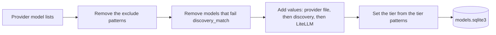

# Providers

These are the only providers that tests confirmed as really free.

| Provider key | Provider | API | Notes |
| --- | --- | --- | --- |
| `cloudflare` | Cloudflare Workers AI | OpenAI-compatible, plus the native run API for audio and images | Text content only. Paid models stay out of the catalog. The catalog gets 5 tasks only (see below). |
| `gemini` | Google Gemini | Native Gemini API | Daedalus maps OpenAI requests to Gemini and back, with thought signatures. |
| `groq` | Groq | OpenAI-compatible | Gets only the message fields that it accepts. |
| `kilo` | Kilo Gateway | OpenAI-compatible | |
| `mistral` | Mistral | OpenAI-compatible | Gets only the message fields that it accepts. `reasoning_effort` `none` and `minimal` become `none`, and `low` to `xhigh` become `high`. The thinking chunks of an answer go to `reasoning_content`. An old assistant message with `reasoning_content` goes back as a thinking chunk before its text. |
| `openrouter` | OpenRouter | OpenAI-compatible | |
| `z-ai` | Z.ai | OpenAI-compatible | |

Kilo and OpenRouter are large, known gateways with free models that change over time. Google Gemini has a more generous free tier than the other providers.

## Catalog

`daedalus catalog` makes the model store in `.daedalus-state/models.sqlite3`.

| Rule | Value |
| --- | --- |
| Schedule | Each 6 h from 06:00 in `TZ`. `catalog.every: 0` stops it. |
| Provider error | Daedalus keeps the old rows of that provider only. |
| Chat chains | Only chat rows, and rows with no mode, go into the chains. |

Cloudflare tasks in the catalog:

| Cloudflare task | Mode |
| --- | --- |
| Text Generation | `chat` |
| Automatic Speech Recognition | `audio_transcription` |
| Text-to-Speech | `audio_speech` |
| Text-to-Image | `image_generation` |
| Text Embeddings | `embedding` |

Models of other tasks stay out of the catalog.

## Endpoints for models that do not chat

| Provider | Embeddings | Transcriptions | Speech | Images |
| --- | --- | --- | --- | --- |
| Cloudflare | Yes | Whisper, native API | MeloTTS and Aura, native API | Flux and SDXL-type models, native API |
| Gemini | Yes, native API | `gemini-3.5-transcribe`, native API | 3.x TTS models, native API | 400 |
| Groq | - | Yes | Yes | - |
| Mistral | Yes | `language` and `temperature` only | - | - |

- "Yes": the provider has free models for this endpoint.
- "-": we know of no free model. Daedalus sends the request to the OpenAI-compatible API of the provider.
- "400": Daedalus stops the request.

Limits of the native Cloudflare API:

| Endpoint | Limit |
| --- | --- |
| Transcriptions | `response_format` is `json`, `text` or `vtt` |
| Speech | MeloTTS answers in MP3 only |
| Images | 1 image for each request. Flux 1 ignores `size`. |

Limits of the native Gemini API:

| Endpoint | Limit |
| --- | --- |
| Transcriptions | `response_format` is `json` or `text`. Daedalus adds `language` and `prompt` to the instruction. |
| Speech | `response_format` is `wav` (the default) or `pcm`. `voice` is a Gemini voice name, for example `Kore`. Gemini ignores `speed`. |

The Gemini exclude list keeps these models out:

| Models | Reason |
| --- | --- |
| The 2.5 family, TTS included | Only past users can use them. |
| Live models | They use only the Live API, a websocket. Daedalus does not support it. |
| Models with a 0/0 free quota | Images, Omni, Lyria, Veo, 3.1 Pro, Deep Research, Computer Use |
| Robotics ER, Antigravity | They are for robot vision and for agents. |

> Q: Which of these endpoints do you use, and with which client?
