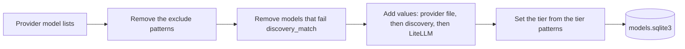

# Providers

These are the only providers that tests confirmed as really free.

| Provider key | Provider | API | Notes |
| --- | --- | --- | --- |
| `cloudflare` | Cloudflare Workers AI | OpenAI-compatible, plus the native run API for audio and images | A message with only text parts goes as 1 string. Paid models stay out of the catalog. The catalog gets 5 tasks only (see below). Order 2. |
| `gemini` | Google Gemini | Native Gemini API | Daedalus maps OpenAI requests to Gemini and back, with thought signatures. The `gemini` block of `free.yml` sets `reasoning_effort: high` for each model. |
| `groq` | Groq | OpenAI-compatible | Gets only the message fields that it accepts. |
| `kilo` | Kilo Gateway | OpenAI-compatible | Only `:free` models, and `stealth/` models with price 0 in each price field. |
| `mistral` | Mistral | OpenAI-compatible | Gets only the message fields that it accepts. `reasoning_effort` `none` and `minimal` become `none`, and `low` to `xhigh` become `high`. The thinking chunks of an answer go to `reasoning_content`. An old assistant message with `reasoning_content` goes back as a thinking chunk before its text. |
| `openrouter` | OpenRouter | OpenAI-compatible, plus the OpenRouter Image API (`/images`). Speech is mp3, unless the client asks for pcm. | Only `:free` models, and `stealth/` models with price 0 in each price field. Discovery lists each output type, and the output type sets the mode: for example, the free embedding and speech models are direct models. No image model: image generation needs a credit balance. |
| `pollinations` | Pollinations | OpenAI-compatible | Only 4 image models for `daedalus/photos`, at 0.0001 to 0.005 Pollen for each image: `lykon/dreamshaper-8-lcm`, `black-forest-labs/flux.1-schnell`, `tongyi-mai/z-image-turbo` and `black-forest-labs/flux.2-klein-4b`. Order 2, as Cloudflare. |
| `z-ai` | Z.ai | OpenAI-compatible | Only the 3 free models under `models:`: `glm-4.5-flash`, `glm-4.7-flash` and `glm-4.6v-flash`. |

Kilo and OpenRouter are large, known gateways with free models that change over time. Google Gemini has a more generous free tier than the other providers.

| Provider | How Daedalus keeps it free |
| --- | --- |
| Cloudflare, Gemini, Groq, Mistral | Use an account on the free plan, with no payment method. |
| Kilo, OpenRouter | The `!*:free` exclude pattern. A price of 0 is not a guarantee: Lyria models show price 0 and cost money for each song. |
| Pollinations | The `"*"` exclude pattern, and only the 4 image models under `models:`. The account spends only its free Quest Pollen, with no payment method. |
| Z.ai | The `"*"` exclude pattern, and only the free models under `models:`. |

> Q: The Pollinations API docs name the free balance Quest Pollen. Quests give it, and the docs describe no refill with time. In 2025, the free tier gave 1 Pollen each day, with no carry over. `GET https://gen.pollinations.ai/account/balance` shows the balance.

## Catalog

`daedalus catalog` makes the model store in `.daedalus-state/models.sqlite3`.

| Rule | Value |
| --- | --- |
| Schedule | Each 6 h from 06:00 in `TZ`. `catalog.every: 0` stops it. |
| Provider error | Daedalus keeps the old rows of that provider only. |
| Chat chains | Only chat rows, and rows with no mode, go into the chains. |
| Stealth models | On Kilo and OpenRouter, a `stealth/` model with price 0 in each price field passes `exclude`. A stealth model with a price stays out. |

Cloudflare tasks in the catalog:

| Cloudflare task | Mode |
| --- | --- |
| Text Generation | `chat` |
| Automatic Speech Recognition | `audio_transcription` |
| Text-to-Speech | `audio_speech` |
| Text-to-Image | `image_generation` |
| Text Embeddings | `embedding` |

Models of other tasks stay out of the catalog.

OpenRouter output types in the catalog. Kilo keeps only the models that make text: its gateway accepts only `/chat/completions`.

| Output type | Mode |
| --- | --- |
| Text, also with other types | `chat` |
| Speech | `audio_speech` |
| Image | `image_generation` |
| Embeddings | `embedding` |
| Video | `video_generation` |
| Another type | The name of the type |

A mode that Daedalus does not know keeps the model out of each chain and pool.

## Endpoints for models that do not chat

| Provider | Embeddings | Transcriptions | Speech | Images | Image edits |
| --- | --- | --- | --- | --- | --- |
| Cloudflare | Yes | Whisper, native API | MeloTTS and Aura, native API | Flux and SDXL-type models, native API | FLUX.2, native API |
| Gemini | Yes, native API | `gemini-3.5-transcribe`, native API | 3.x TTS models, native API | 400 | 400 |
| Groq | - | Yes | Yes | - | - |
| Mistral | Yes | `language` and `temperature` only | - | - | - |
| OpenRouter | Yes | - | Yes, mp3 or pcm | Image API, needs a credit balance | Image API, `input_references` |
| Pollinations | - | - | - | Yes, with Pollen | `flux.2-klein-4b`, with Pollen |

- "Yes": the provider has free models for this endpoint.
- "-": we know of no free model. Daedalus sends the request to the OpenAI-compatible API of the provider.
- "400": Daedalus stops the request.

Limits of the native Cloudflare API:

| Endpoint | Limit |
| --- | --- |
| Transcriptions | `response_format` is `json`, `text` or `vtt` |
| Speech | MeloTTS answers in MP3 only |
| Images | 1 image for each request. Flux 1 ignores `size`. FLUX.2 takes only multipart input, so Daedalus sends a multipart form to FLUX.2 models. |
| Image edits | FLUX.2 only, up to 4 input images, no mask. Each input image must be smaller than 512x512, so Daedalus sends a PNG copy with the long side at 511 pixels. |

Limits of the native Gemini API:

| Endpoint | Limit |
| --- | --- |
| Transcriptions | `response_format` is `json` or `text`. Daedalus adds `language` and `prompt` to the instruction. |
| Speech | `response_format` is `wav` (the default) or `pcm`. `voice` is a Gemini voice name, for example `Kore`. Gemini ignores `speed`. |

The Gemini exclude list keeps these models out:

| Models | Reason |
| --- | --- |
| The 2.5 family, TTS included | Only past users can use them. |
| Live models | They use only the Live API, a websocket. Daedalus does not support it. |
| Models with a 0/0 free quota | Images, Omni, Lyria, Veo, 3.1 Pro, Deep Research, Computer Use |
| Robotics ER, Antigravity | They are for robot vision and for agents. |
| `aqa` | It answers from given sources only. |
| `*-latest` aliases | The model behind each alias changes over time. |

No client used these endpoints in a test yet.
